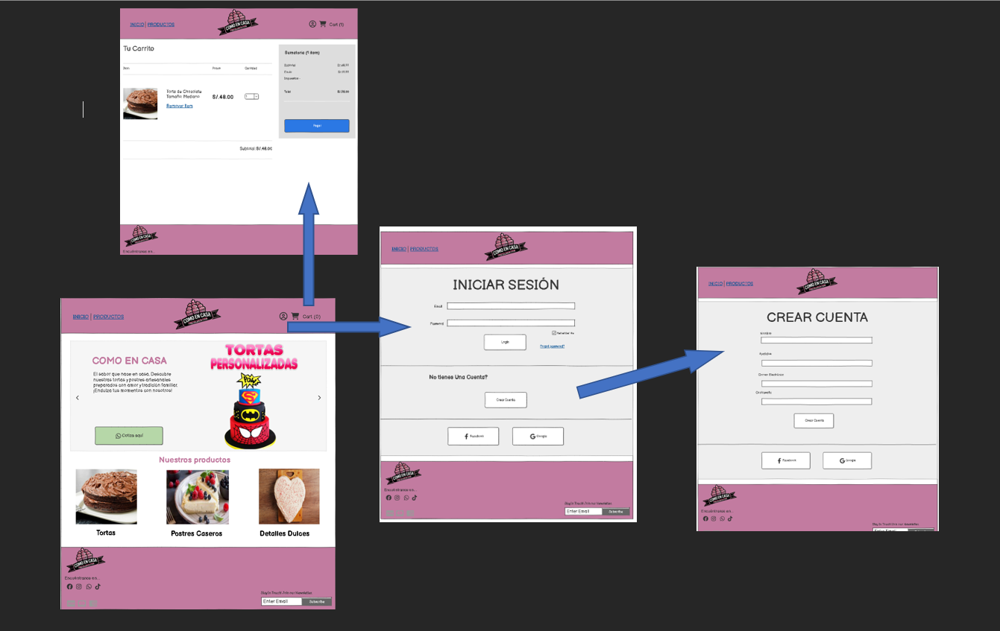
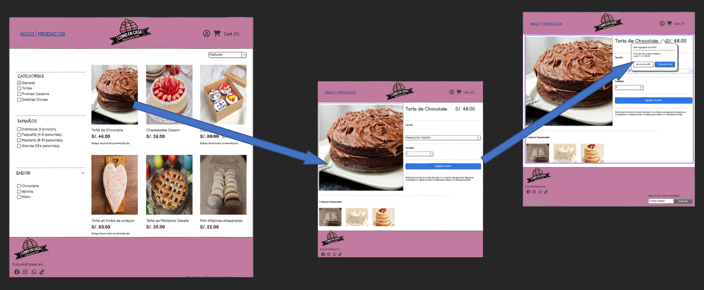
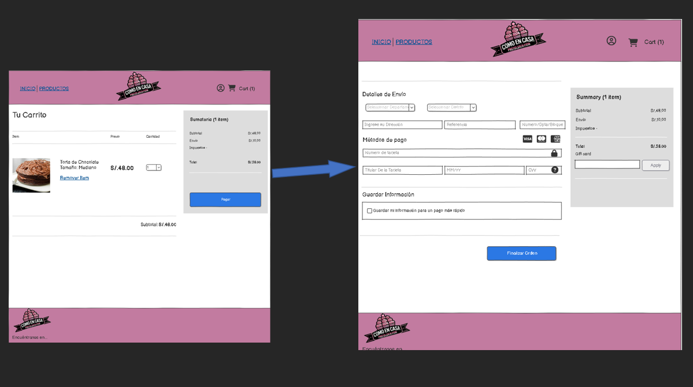

# Sistema de la Pasteleria "Como en Casa" - Documentación de Mockups 3

## Tabla de Contenidos
1. [Inicio](#Inicio)
2. [Productos](#Productos)
3. [Registro del Login](#registro-del-login)
4. [Boleta](#boleta)

---

## 1. Inicio

### Descripción:
El módulo de **Inicio** tiene como objetivo centralizar la información de los Inicio que requieren Productos. Dado que es necesario mantener una base de datos actualizada de los Inicio, este módulo permite registrar Inicio con facilidad. Este módulo es vital para la administración interna, ya que cualquier transacción o servicio está asociado a un cliente específico.

### Motivo de uso:
Este mockup es utilizado por los empleados de la pasteleria para gestionar de forma rápida y eficiente los datos de sus Inicio. La pasteleria **"Como en Casa"** necesita tener un registro organizado de los Inicio para gestionar los servicios adquiridos, generar boletas y realizar seguimiento de cada cliente. El propósito principal es mantener un historial y gestionar relaciones con los Inicio de manera profesional.

### Componentes:
- **Formulario Nuevo Cliente:**
  - **Apellido del Cliente**: Campo de texto para ingresar el apellido del cliente.
  - **Nombre del Cliente**: Campo de texto para ingresar el nombre del cliente.
  - **Correo Electronico**: Campo de texto para ingresar el correo electronico del cliente.
  - **Botones**:
    - `Crear Cuenta`: Guarda los datos del cliente en la base de datos.
    - `Forgot password`: Cambia la contraseña de los datos del cliente en la base de datos.
    

- **Tabla de Inicio**:
  - Muestra la lista de los Inicio registrados. Las columnas incluyen:
    - `Apellido deL Cliente`: Apellidos del cliente.
    - `Nombre del Cliente`: Nombre del cliente.
    - `Correo Electronico`: Correo Electronico del cliente.

- **Acciones Disponibles**:
  - `Login`: Despliega el formulario para ingresar un cliente.
  - `Crear Cuenta`: Despliega el formulario para ingresar un nuevo cliente.
  - `Forgot password`: Permite seleccionar una nueva contraseña del cliente y modificar sus datos.
  - `Facebook`: Ingresa con una cuente registrada en Facebook.
  - `Google`: Ingresa con una cuenta registrada en Google.

---

## 2. Productos

### Descripción:
El módulo de **Productos** está diseñado para la administración de los servicios que ofrece la pasteleria. Los servicios pueden incluir desde vista previo del producto hasta añadir al carrito, y deben ser gestionados de manera que estén disponibles cuando un cliente lo requiera. Este módulo permite agregar, modificar y eliminar Productos de manera eficiente.

### Motivo de uso:
Este mockup es esencial para que los administradores de la pasteleria mantengan un registro actualizado de los Productos ofrecidos y sus respectivos costos. Los servicios pueden variar según la demanda y las circunstancias, por lo que es crucial que el personal tenga acceso rápido y directo a esta información para ofrecerla a los Inicio, agilizando la generación de boletas y contratos.

### Componentes:
- **Formulario Nuevo Producto:**
  - **Código del Producto**: Campo de texto para ingresar un código único de identificación para cada producto.
  - **Descripción**: Campo de texto para describir el tipo de servicio pastelero (por ejemplo, "tipo", "Sabor").
  - **Costo**: Campo numérico para ingresar el costo del producto.
  - **Fecha y Hora**: Campos para especificar cuándo estará el producto.
  - **Ubicación**: Campo de texto para la ubicación donde se brindará el producto.
  - **Botones**:
    - `Aceptar`: Guarda los datos del servicio en la base de datos.
    - `Cancelar`: Cancela la operación y cierra el formulario.

- **Tabla de Productos**:
  - Muestra todos los Productos disponibles con las siguientes columnas:
    - `Código de Producto`: Código único del producto.
    - `Descripción`: Descripción del producto.
    - `Costo`: Precio asociado al producto.
    - `Fecha y Hora`: Fecha y hora programada para el producto.
    - `Ubicación`: Lugar donde se llevará el producto.

- **Acciones Disponibles**:
  - `Agregar`: Permite agregar un nuevo producto.
  - `Editar`: Permite modificar los detalles de un servicio seleccionado.
  - `Borrar`: Elimina un servicio del sistema después de la confirmación del usuario.

---

## 3. Registro del Login

### Descripción:
El módulo **Registro del Login** es una herramienta indispensable para registrar y organizar la información de los clientes que recibirán los Productos. Este módulo contiene todos los detalles relevantes sobre la clientela, además de la información de contacto del responsable. El registro adecuado de esta información es vital para la logística y coordinación de los Productos.

### Motivo de uso:
El propósito de este mockup es gestionar los datos del cliente, ya que cada producto pastelero está asociado a una persona. Es crucial contar con un registro detallado de cada producto para asegurar que los servicios proporcionados sean precisos y acordes con las solicitudes. Este módulo permite tener una visión clara y completa del historial de productos atendidos por la pasteleria.

### Componentes:
- **Formulario Nuevo Registro**:
  - **Nombres**: Campo de texto para el nombre completo del cliente.
  - **Apellidos**: Campo de texto para el Apellido completo del cliente.
  - **Correo Electronico**: Campo de texto para el correo Electronico del cliente.
  - **Contraseña**: Campo de texto para agregar la contraseña del cliente.
  - **Botón**:
    - `Crear cuenta`: Guarda el registro en la base de datos.

- **Tabla de Registros**:
  - Muestra los registros existentes en el sistema, con columnas que incluyen:
    - `Nombres`: Nombre del Cliente.
    - `Apellidos`: Apellido del Cliente.
    - `Correo Electronico`: Correo Electronico del Cliente.
    - `Contraseña del Cliente`: Contraseña del Cliente.

- **Acciones Disponibles**:
  - `Agregar`: Permite ingresar un nuevo registro.
  - `Editar`: Modifica un registro existente seleccionado.
  - `Borrar`: Elimina un registro tras confirmación.

---

## 4. Boleta

### Descripción:
El módulo de **Boleta** permite la emisión de recibos por los Productos contratados por los Inicio. Incluye detalles importantes sobre la pasteleria, el cliente, el producto y los servicios solicitados. La boleta se genera como documento formal y sirve para registrar la transacción entre la pasteleria y el cliente.

### Motivo de uso:
El mockup de **Boleta** es fundamental para cerrar una transacción del servicio de la pasteleria. Proporciona una manera clara y formal de comunicar el costo de los servicios proporcionados, detallando cada uno de los servicios. Además, asegura que la pasteleria puede emitir un documento válido y legalmente reconocido para sus Inicio.

### Componentes:
- **Formulario Generar Boleta**:
  - **Código**: Campo de texto para ingresar el código único de la boleta.
  - **Fecha de Emisión**: Campo de fecha para registrar cuándo se emitió la boleta.

  - **Datos de la pasteleria**:
    - **RUC**: Campo de texto para el número de RUC de la pasteleria.
    - **Nombre**: Campo de texto para el nombre comercial de la pasteleria.

  - **Datos del Cliente**:
    - **Nombres y Apellidos**: Campo de texto para ingresar el nombre completo del cliente.
    - **Seleccionar Departamento**: Campo de texto para ingresar el departamento del cliente.
    - **Seleccionar Distrito**: Campo de texto para ingresar el distrito del cliente.
    - **Dirección**: Campo de texto para ingresar la direccion, referencia y el bloque del cliente.

  - **Metodos de Pago**:
    - Tabla que muestra los metodos de pago con las siguientes columnas:
      - **Código**: Código de la tarjeta del cliente.
      - **Descripción**: Descripción de la tarjeta del cliente.
      - **Guardar Información**: Guardar información del cliente para un pago más rápido (si es aplicable).
     