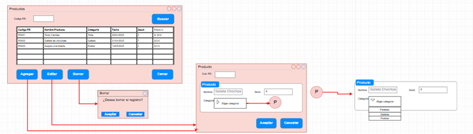
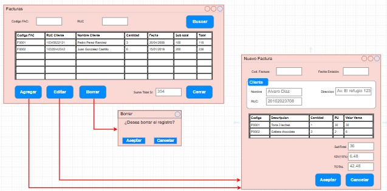
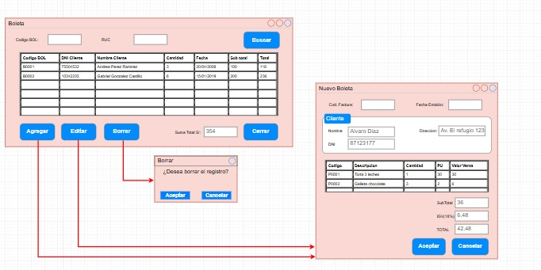

# Sistema de Gestión - "Como en Casa"  
**Documentación de Mockups**

---

## Tabla de Contenidos  
1. [Registro de Productos](#1-registro-de-productos)  
2. [Boleta](#2-boleta)  
3. [Factura](#3-factura)

---

## 1. Registro de Productos

**Descripción:**  
Este módulo permite gestionar el catálogo de productos que ofrece la pastelería "Como en Casa". Incluye el registro de productos como tortas, cupcakes, galletas personalizadas, entre otros. Es fundamental para mantener actualizado el stock y ofrecer una atención precisa.

**Motivo de uso:**  
Utilizado por el personal administrativo o encargado de inventario para ingresar nuevos productos, modificar información existente o eliminar productos que ya no están disponibles. Es la base para el proceso de ventas, ya que estos productos se seleccionan en la Boleta y Factura.

**Componentes:**  
- **Formulario de Registro:**
  - Código del Producto
  - Nombre del Producto
  - Precio
  - Stock
  - Botones:  
    - Aceptar  
    - Cancelar  

- **Tabla de Productos Registrados:**
  - Código
  - Nombre
  - Precio
  - Stock
  - Acciones: Editar | Eliminar

**Mockup:**  

---

## 2. Boleta

**Descripción:**  
El módulo de Boleta permite registrar las ventas realizadas a clientes, detallando los productos adquiridos, sus cantidades, precios y el total a pagar. También incluye los datos del cliente.

**Motivo de uso:**  
Sirve para emitir comprobantes de pago a los clientes que realizan compras. Es útil tanto para el control interno como para entregar un documento válido al cliente por su compra.

**Componentes:**
- **Formulario Boleta:**
  - Código de Boleta
  - Fecha
  - Cliente:
    - DNI
    - Nombre
    - Dirección
  - Detalle del Pedido:
    - Código del Producto
    - Descripción
    - Precio
    - Cantidad
    - Total parcial
  - Totales:
    - Subtotal
    - IGV (18%)
    - Total Final
  - Botones:
    - Generar Boleta
    - Cancelar

**Mockup:**  

---

## 3. Factura

**Descripción:**  
La pantalla de Factura permite generar comprobantes para clientes que requieren facturación con RUC. Incluye información tributaria de "Como en Casa" y del cliente, así como los productos vendidos.

**Motivo de uso:**  
Se usa para registrar ventas formales a clientes con RUC, permitiendo un control contable más detallado y cumplimiento tributario. Es útil para negocios, empresas o eventos que solicitan factura en lugar de boleta.

**Componentes:**
- **Cabecera:**
  - Código de Factura
  - Fecha de Emisión

- **Datos de la Empresa:**
  - RUC
  - Nombre Comercial (Como en Casa)

- **Datos del Cliente:**
  - RUC del Cliente
  - Dirección
  - Nombre o Razón Social
  - Referencia

- **Detalle de Venta:**
  - Código del Producto
  - Descripción
  - Cantidad
  - Precio Unitario
  - Valor de Venta

- **Totales:**
  - Subtotal
  - IGV (18%)
  - Total a Pagar
  - Cajero Responsable

- **Botones:**
  - Aceptar
  - Cancelar

**Mockup:**  

