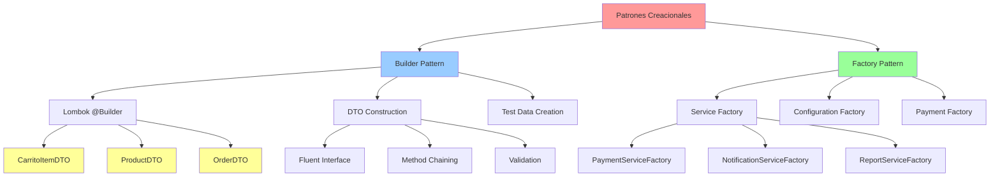

# Patrones Builder y Factory - Creación de Objetos

## Descripción General

Los patrones Builder y Factory son patrones creacionales que facilitan la construcción de objetos complejos de manera flexible y mantenible. En el sistema "Como en Casa", estos patrones se implementan principalmente a través de Lombok para DTOs y para la creación de objetos de prueba y configuración.

## Diagrama de Implementación



## Implementación de Patrones Builder y Factory

### 1. Builder Pattern con Lombok

El patrón Builder facilita la creación de objetos complejos paso a paso.

**Ejemplo: CarritoItemDTO**

```java
@Data
@Builder
@NoArgsConstructor
@AllArgsConstructor
public class CarritoItemDTO {
    private Long productoId;
    private String nombre;
    private String descripcion;
    private Double precioVenta;
    private String imagenUrl;
    private Integer cantidad;
    private String comentarios;
    private Double subtotal;

    // Constructor personalizado con cálculo automático
    public CarritoItemDTO(Long productoId, String nombre, Double precioVenta, Integer cantidad) {
        this.productoId = productoId;
        this.nombre = nombre;
        this.precioVenta = precioVenta;
        this.cantidad = cantidad;
        this.subtotal = precioVenta * cantidad;
    }
}
```

**Uso del Builder en CarritoService:**

```java
@Service
@Slf4j
public class CarritoService {

    private final ProductRepository productRepository;
    private final Cache<String, List<CarritoItemDTO>> carritoCache;

    public CarritoItemDTO agregarProducto(String carritoId, Long productoId, Integer cantidad) {
        Product producto = productRepository.findById(productoId)
                .orElseThrow(() -> new ProductNotFoundException("Producto no encontrado"));

        // Uso del Builder Pattern para crear el DTO
        CarritoItemDTO item = CarritoItemDTO.builder()
                .productoId(producto.getId())
                .nombre(producto.getName())
                .descripcion(producto.getDescription())
                .precioVenta(producto.getPrice().doubleValue())
                .imagenUrl(producto.getImageUrl())
                .cantidad(cantidad)
                .comentarios("")
                .subtotal(producto.getPrice().doubleValue() * cantidad)
                .build();

        actualizarCarrito(carritoId, item);
        return item;
    }
}
```

**Ejemplo: ProductDTO con Builder**

```java
@Data
@Builder
@NoArgsConstructor
@AllArgsConstructor
@JsonInclude(JsonInclude.Include.NON_NULL)
public class ProductDTO {
    private Long id;
    private String name;
    private String description;
    private BigDecimal price;
    private Integer stock;
    private String imageUrl;
    private String category;
    private Boolean available;
    private LocalDateTime createdAt;
    private LocalDateTime updatedAt;

    // Builder personalizado con validaciones
    public static class ProductDTOBuilder {
        public ProductDTOBuilder priceWithValidation(BigDecimal price) {
            if (price != null && price.compareTo(BigDecimal.ZERO) < 0) {
                throw new IllegalArgumentException("El precio no puede ser negativo");
            }
            this.price = price;
            return this;
        }

        public ProductDTOBuilder stockWithValidation(Integer stock) {
            if (stock != null && stock < 0) {
                throw new IllegalArgumentException("El stock no puede ser negativo");
            }
            this.stock = stock;
            return this;
        }
    }
}
```

### 2. Factory Pattern para Servicios

El patrón Factory centraliza la creación de objetos y permite seleccionar implementaciones específicas.

**Ejemplo: PaymentServiceFactory**

```java
@Component
@Slf4j
public class PaymentServiceFactory {

    private final PayPalPaymentService payPalPaymentService;
    private final CreditCardPaymentService creditCardPaymentService;
    private final Map<PaymentType, PaymentService> paymentServices;

    public PaymentServiceFactory(
            PayPalPaymentService payPalPaymentService,
            CreditCardPaymentService creditCardPaymentService) {
        this.payPalPaymentService = payPalPaymentService;
        this.creditCardPaymentService = creditCardPaymentService;

        // Inicializar el mapa de servicios
        this.paymentServices = Map.of(
            PaymentType.PAYPAL, payPalPaymentService,
            PaymentType.CREDIT_CARD, creditCardPaymentService
        );
    }

    public PaymentService getPaymentService(PaymentType paymentType) {
        PaymentService service = paymentServices.get(paymentType);
        if (service == null) {
            throw new UnsupportedPaymentMethodException(
                "Método de pago no soportado: " + paymentType);
        }

        log.info("Servicio de pago seleccionado: {}", paymentType);
        return service;
    }

    public List<PaymentType> getAvailablePaymentMethods() {
        return new ArrayList<>(paymentServices.keySet());
    }
}
```

**Uso del Factory en OrderService:**

```java
@Service
@Slf4j
public class OrderService {

    private final PaymentServiceFactory paymentServiceFactory;
    private final OrderRepository orderRepository;

    public OrderService(PaymentServiceFactory paymentServiceFactory,
                       OrderRepository orderRepository) {
        this.paymentServiceFactory = paymentServiceFactory;
        this.orderRepository = orderRepository;
    }

    @Transactional
    public OrderDTO processOrder(OrderDTO orderDTO) {
        // Usar el factory para obtener el servicio de pago apropiado
        PaymentService paymentService = paymentServiceFactory
                .getPaymentService(orderDTO.getPaymentType());

        // Procesar pago
        PaymentResponse response = paymentService.processPayment(
                createPaymentRequest(orderDTO));

        if (!response.isSuccess()) {
            throw new PaymentProcessingException("Error en el pago: " + response.getMessage());
        }

        // Continuar con el procesamiento de la orden
        Order order = mapToEntity(orderDTO);
        order.setPaymentStatus(PaymentStatus.COMPLETED);
        order.setTransactionId(response.getTransactionId());

        Order savedOrder = orderRepository.save(order);
        return mapToDTO(savedOrder);
    }
}
```

### 3. Builder Pattern para Objetos de Prueba

**Ejemplo: TestDataBuilder**

```java
@Component
public class TestDataBuilder {

    // Builder para crear productos de prueba
    public static Product.ProductBuilder defaultProductBuilder() {
        return Product.builder()
                .name("Producto de Prueba")
                .description("Descripción del producto de prueba")
                .price(BigDecimal.valueOf(10.99))
                .stock(100)
                .imageUrl("https://example.com/image.jpg")
                .category("Categoría Test")
                .available(true);
    }

    // Builder para crear usuarios de prueba
    public static User.UserBuilder defaultUserBuilder() {
        return User.builder()
                .firstName("Juan")
                .lastName("Pérez")
                .email("juan.perez@test.com")
                .password("password123")
                .role(UserRole.CUSTOMER)
                .enabled(true)
                .verified(true);
    }

    // Builder para crear órdenes de prueba
    public static Order.OrderBuilder defaultOrderBuilder() {
        return Order.builder()
                .orderDate(LocalDateTime.now())
                .status(OrderStatus.PENDING)
                .total(BigDecimal.valueOf(29.99))
                .paymentType(PaymentType.PAYPAL)
                .paymentStatus(PaymentStatus.PENDING)
                .items(new ArrayList<>());
    }
}
```

**Uso en Tests:**

```java
@Test
public void testCreateProduct() {
    // Usar el builder para crear datos de prueba
    Product product = TestDataBuilder.defaultProductBuilder()
            .name("Pastel de Chocolate")
            .price(BigDecimal.valueOf(25.99))
            .stock(50)
            .build();

    ProductDTO result = productService.createProduct(mapToDTO(product));

    assertThat(result.getName()).isEqualTo("Pastel de Chocolate");
    assertThat(result.getPrice()).isEqualByComparingTo(BigDecimal.valueOf(25.99));
    assertThat(result.getStock()).isEqualTo(50);
}
```

### 4. Factory Pattern para Configuración

**Ejemplo: ConfigurationFactory**

```java
@Component
@Slf4j
public class ConfigurationFactory {

    @Value("${app.environment:development}")
    private String environment;

    @Bean
    public DataSource dataSource() {
        if ("production".equals(environment)) {
            return createProductionDataSource();
        } else if ("test".equals(environment)) {
            return createTestDataSource();
        } else {
            return createDevelopmentDataSource();
        }
    }

    private DataSource createProductionDataSource() {
        HikariDataSource dataSource = new HikariDataSource();
        dataSource.setJdbcUrl("jdbc:mysql://localhost:3306/comoencasa_prod");
        dataSource.setUsername("prod_user");
        dataSource.setPassword("prod_password");
        dataSource.setMaximumPoolSize(20);
        return dataSource;
    }

    private DataSource createTestDataSource() {
        HikariDataSource dataSource = new HikariDataSource();
        dataSource.setJdbcUrl("jdbc:h2:mem:testdb");
        dataSource.setUsername("sa");
        dataSource.setPassword("");
        dataSource.setMaximumPoolSize(5);
        return dataSource;
    }

    private DataSource createDevelopmentDataSource() {
        HikariDataSource dataSource = new HikariDataSource();
        dataSource.setJdbcUrl("jdbc:mysql://localhost:3306/comoencasa_dev");
        dataSource.setUsername("dev_user");
        dataSource.setPassword("dev_password");
        dataSource.setMaximumPoolSize(10);
        return dataSource;
    }
}
```

## Ventajas de la Implementación

### 🏗️ **Builder Pattern**

- **Flexibilidad**: Creación de objetos paso a paso
- **Legibilidad**: Código más expresivo y fácil de entender
- **Immutabilidad**: Objetos inmutables una vez creados
- **Validación**: Validaciones durante la construcción

### 🏭 **Factory Pattern**

- **Encapsulación**: Lógica de creación centralizada
- **Extensibilidad**: Fácil adición de nuevos tipos
- **Configuración**: Selección basada en parámetros
- **Testabilidad**: Fácil mockeo y sustitución

## Integración con Spring Boot

### Lombok Integration

```java
@Data
@Builder
@NoArgsConstructor
@AllArgsConstructor
@Entity
public class Product {
    @Id
    @GeneratedValue(strategy = GenerationType.IDENTITY)
    private Long id;

    private String name;
    private String description;
    private BigDecimal price;
    private Integer stock;

    // Lombok genera automáticamente:
    // - ProductBuilder class
    // - builder() method
    // - Getters y setters
    // - Constructor con todos los argumentos
    // - Constructor sin argumentos
}
```

### Spring Factory Beans

```java
@Configuration
public class FactoryConfiguration {

    @Bean
    @ConditionalOnProperty(name = "payment.provider", havingValue = "paypal")
    public PaymentService paypalPaymentService() {
        return new PayPalPaymentService();
    }

    @Bean
    @ConditionalOnProperty(name = "payment.provider", havingValue = "stripe")
    public PaymentService stripePaymentService() {
        return new StripePaymentService();
    }
}
```

## Patrones Complementarios

Los patrones Builder y Factory se complementan con:

- **SOLID Principles**: Especialmente Open/Closed y Single Responsibility
- **DAO Pattern**: Para la creación de repositorios
- **MVC Pattern**: Para la creación de DTOs y respuestas
- **Strategy Pattern**: Para la selección de implementaciones

Esta implementación garantiza que el sistema "Como en Casa" mantiene un código limpio, flexible y fácil de mantener en la creación de objetos complejos.

---

### 🔹 **2. Test Data Factory Pattern**

#### **📍 Ubicación:** `test/testutil/TestDataFactory.java`

**Factory Pattern para creación de datos de prueba:**

```java
/**
 * Factory para crear objetos de test siguiendo el patrón Test Data Builder
 * Facilita la creación de datos de prueba consistentes
 */
public class TestDataFactory {

    // BUILDER INTERNO PARA PRODUCTOS
    public static class ProductoTestBuilder {
        private Producto producto;

        public ProductoTestBuilder() {
            this.producto = new Producto();
            // Valores por defecto
            this.producto.setNombre("Producto Test");
            this.producto.setDescripcion("Descripción de producto test");
            this.producto.setPrecioVenta(100.0);
            this.producto.setCostoProduccion(50.0);
            this.producto.setDisponible(true);
            this.producto.setCantidad(10);
            this.producto.setCategoriaId(1L);
        }

        public ProductoTestBuilder conNombre(String nombre) {
            this.producto.setNombre(nombre);
            return this;
        }

        public ProductoTestBuilder conPrecio(Double precio) {
            this.producto.setPrecioVenta(precio);
            return this;
        }

        public ProductoTestBuilder conCosto(Double costo) {
            this.producto.setCostoProduccion(costo);
            return this;
        }

        public ProductoTestBuilder conCategoria(Long categoriaId) {
            this.producto.setCategoriaId(categoriaId);
            return this;
        }

        public ProductoTestBuilder noDisponible() {
            this.producto.setDisponible(false);
            return this;
        }

        public ProductoTestBuilder conCantidad(Integer cantidad) {
            this.producto.setCantidad(cantidad);
            return this;
        }

        public ProductoTestBuilder conId(Long id) {
            this.producto.setId(id);
            return this;
        }

        public Producto build() {
            return this.producto;
        }
    }

    // BUILDER INTERNO PARA USUARIOS
    public static class UsuarioTestBuilder {
        private Usuario usuario;

        public UsuarioTestBuilder() {
            this.usuario = new Usuario();
            // Valores por defecto
            this.usuario.setNombre("Usuario");
            this.usuario.setApellido("Test");
            this.usuario.setEmail("test@test.com");
            this.usuario.setPassword("password123");
            this.usuario.setTelefono("123456789");
            this.usuario.setDireccion("Dirección Test");
            this.usuario.setTipoDocumento(Usuario.TipoDocumento.DNI);
            this.usuario.setNumeroDocumento("12345678");
            this.usuario.setRol(Usuario.Rol.CLIENTE);
            this.usuario.setActivado(true);
        }

        public UsuarioTestBuilder conNombre(String nombre) {
            this.usuario.setNombre(nombre);
            return this;
        }

        public UsuarioTestBuilder conApellido(String apellido) {
            this.usuario.setApellido(apellido);
            return this;
        }

        public UsuarioTestBuilder conNombreCompleto(String nombre, String apellido) {
            this.usuario.setNombre(nombre);
            this.usuario.setApellido(apellido);
            return this;
        }

        public UsuarioTestBuilder conEmail(String email) {
            this.usuario.setEmail(email);
            return this;
        }

        public UsuarioTestBuilder conPassword(String password) {
            this.usuario.setPassword(password);
            return this;
        }

        public UsuarioTestBuilder conRol(Usuario.Rol rol) {
            this.usuario.setRol(rol);
            return this;
        }

        public UsuarioTestBuilder inactivo() {
            this.usuario.setActivado(false);
            return this;
        }

        public UsuarioTestBuilder conId(Long id) {
            this.usuario.setId(id);
            return this;
        }

        public Usuario build() {
            return this.usuario;
        }
    }

    // BUILDER INTERNO PARA CATEGORÍAS
    public static class CategoriaTestBuilder {
        private Categoria categoria;

        public CategoriaTestBuilder() {
            this.categoria = new Categoria();
            this.categoria.setNombre("Categoria Test");
            this.categoria.setDescripcion("Descripción de categoría test");
        }

        public CategoriaTestBuilder conNombre(String nombre) {
            this.categoria.setNombre(nombre);
            return this;
        }

        public CategoriaTestBuilder conDescripcion(String descripcion) {
            this.categoria.setDescripcion(descripcion);
            return this;
        }

        public CategoriaTestBuilder conId(Long id) {
            this.categoria.setId(id);
            return this;
        }

        public Categoria build() {
            return this.categoria;
        }
    }

    // MÉTODOS FACTORY ESTÁTICOS
    public static ProductoTestBuilder unProducto() {
        return new ProductoTestBuilder();
    }

    public static UsuarioTestBuilder unUsuario() {
        return new UsuarioTestBuilder();
    }

    public static CategoriaTestBuilder unaCategoria() {
        return new CategoriaTestBuilder();
    }
}
```

---

### 🔹 **3. Uso en Tests TDD**

#### **📍 Implementación en tests:**

**Ejemplo en CarritoServiceTDDTest:**

```java
@ExtendWith(MockitoExtension.class)
@DisplayName("🧪 Tests TDD - Servicio de Carrito")
class CarritoServiceTDDTest {

    @Test
    @DisplayName("Debería agregar producto correctamente")
    void deberiaAgregarProducto() {
        // Given - Usando Factory Pattern + Builder
        Producto producto = TestDataFactory.unProducto()
                .conId(1L)
                .conNombre("Torta de Chocolate")
                .conPrecio(25.50)
                .conCantidad(5)
                .build();

        when(productoService.findById(1L)).thenReturn(Optional.of(producto));

        // When
        CarritoDTO resultado = carritoService.agregarProducto(sessionId, 1L, 2, "Sin azúcar");

        // Then
        assertThat(resultado.getItems()).hasSize(1);
        assertThat(resultado.getItems().get(0).getNombre()).isEqualTo("Torta de Chocolate");
        assertThat(resultado.getItems().get(0).getCantidad()).isEqualTo(2);
        assertThat(resultado.getItems().get(0).getComentarios()).isEqualTo("Sin azúcar");
    }

    @Test
    @DisplayName("Debería validar usuario existente")
    void deberiaValidarUsuarioExistente() {
        // Given - Usando múltiples builders para diferentes escenarios
        Usuario usuarioAdmin = TestDataFactory.unUsuario()
                .conId(1L)
                .conEmail("admin@test.com")
                .conRol(Usuario.Rol.ADMIN)
                .build();

        Usuario usuarioCliente = TestDataFactory.unUsuario()
                .conId(2L)
                .conEmail("cliente@test.com")
                .conRol(Usuario.Rol.CLIENTE)
                .build();

        Usuario usuarioInactivo = TestDataFactory.unUsuario()
                .conId(3L)
                .conEmail("inactivo@test.com")
                .inactivo()
                .build();

        // ... resto del test
    }
}
```

**Ejemplo en ProductoServiceTDDTest:**

```java
@ExtendWith(MockitoExtension.class)
class ProductoServiceTDDTest {

    @Nested
    @DisplayName("🔍 Buscar Productos por Categoría")
    class BuscarPorCategoria {

        @Test
        @DisplayName("Debería retornar productos de categoría específica")
        void deberiaRetornarProductosDeCategoria() {
            // Given - Factory + Builder para múltiples productos
            List<Producto> productos = Arrays.asList(
                TestDataFactory.unProducto()
                    .conId(1L)
                    .conNombre("Torta Red Velvet")
                    .conCategoria(1L)
                    .conPrecio(30.0)
                    .build(),

                TestDataFactory.unProducto()
                    .conId(2L)
                    .conNombre("Cheesecake")
                    .conCategoria(1L)
                    .conPrecio(25.0)
                    .build(),

                TestDataFactory.unProducto()
                    .conId(3L)
                    .conNombre("Pan Integral")
                    .conCategoria(2L)  // Categoría diferente
                    .conPrecio(5.0)
                    .build()
            );

            when(productoRepository.findByCategoriaIdAndDisponibleTrue(1L))
                .thenReturn(productos.stream()
                    .filter(p -> p.getCategoriaId().equals(1L))
                    .collect(Collectors.toList()));

            // When
            List<Producto> resultado = productoService.findByCategoriaId(1L);

            // Then
            assertThat(resultado).hasSize(2);
            assertThat(resultado).extracting(Producto::getNombre)
                .containsExactly("Torta Red Velvet", "Cheesecake");
        }
    }
}
```

---

## 🔄 Flujo de Patrones Creacionales

### **📊 Diagrama de Flujo:**

```mermaid
graph TB
    subgraph "🏭 FACTORY PATTERN"
        A[TestDataFactory]
        B[unProducto()]
        C[unUsuario()]
        D[unaCategoria()]
    end

    subgraph "🏗️ BUILDER PATTERN"
        E[ProductoTestBuilder]
        F[UsuarioTestBuilder]
        G[CategoriaTestBuilder]
        H[CarritoItemDTO.builder()]
    end

    subgraph "🧪 TEST USAGE"
        I[CarritoServiceTDDTest]
        J[ProductoServiceTDDTest]
        K[UsuarioServiceTDDTest]
        L[EmailServiceTDDTest]
    end

    subgraph "📦 PRODUCTION USAGE"
        M[CarritoServiceImpl]
        N[ProductoServiceImpl]
        O[UsuarioServiceImpl]
    end

    A --> B
    A --> C
    A --> D

    B --> E
    C --> F
    D --> G

    E --> I
    F --> I
    G --> I
    E --> J
    F --> K

    H --> M
    H --> N
    H --> O

    I --> K
    J --> K
    K --> L

    style A fill:#e1f5fe
    style H fill:#f3e5f5
    style I fill:#e8f5e8
```

---

## ✅ Ventajas de los Patrones Builder y Factory

### **🔹 Builder Pattern:**

- **Flexibilidad**: Construcción paso a paso de objetos complejos
- **Legibilidad**: Código más expresivo y fácil de entender
- **Inmutabilidad**: Objetos bien construidos desde el inicio
- **Validación**: Posibilidad de validar durante la construcción

### **🔹 Factory Pattern:**

- **Centralización**: Un punto único para creación de objetos de test
- **Consistencia**: Datos de prueba uniformes en todo el proyecto
- **Mantenibilidad**: Fácil cambio de configuración por defecto
- **Reutilización**: Mismos builders usados en múltiples tests

### **🔹 Combinación Factory + Builder:**

- **Flexibilidad máxima**: Factory proporciona builders configurables
- **API fluida**: Sintaxis natural para creación de datos
- **Escalabilidad**: Fácil agregar nuevos tipos de objetos
- **Testing eficiente**: Datos de prueba complejos con sintaxis simple

---

## 🎯 Mejores Prácticas Implementadas

### **✅ En Test Data Factory:**

- **Valores por defecto sensatos** para todos los campos
- **Métodos de configuración específicos** para cada caso de uso
- **Naming consistente** (conNombre, conPrecio, etc.)
- **Builders anidados** dentro de la factory para organización

### **✅ En Production Builders:**

- **Uso de Lombok @Builder** para simplificar código
- **Constructores personalizados** cuando es necesario
- **Validación en métodos build()** si es requerida
- **Immutabilidad** cuando es posible

### **✅ En Testing:**

- **Un builder por test** para casos específicos
- **Reutilización** de configuraciones base
- **Tests más legibles** con sintaxis fluida
- **Datos aislados** entre diferentes tests

---

## 🧪 Testing de Patrones Creacionales

### **📝 Ejemplo de test para Factory:**

```java
@Test
@DisplayName("Factory debería crear productos con valores por defecto")
void factoryDeberiaCrearProductosConValoresPorDefecto() {
    // When
    Producto producto = TestDataFactory.unProducto().build();

    // Then
    assertThat(producto.getNombre()).isEqualTo("Producto Test");
    assertThat(producto.getPrecioVenta()).isEqualTo(100.0);
    assertThat(producto.getDisponible()).isTrue();
    assertThat(producto.getCantidad()).isEqualTo(10);
}

@Test
@DisplayName("Builder debería permitir configuración personalizada")
void builderDeberiaPermitirConfiguracionPersonalizada() {
    // When
    Producto producto = TestDataFactory.unProducto()
            .conNombre("Torta Personalizada")
            .conPrecio(45.0)
            .conCantidad(3)
            .noDisponible()
            .build();

    // Then
    assertThat(producto.getNombre()).isEqualTo("Torta Personalizada");
    assertThat(producto.getPrecioVenta()).isEqualTo(45.0);
    assertThat(producto.getCantidad()).isEqualTo(3);
    assertThat(producto.getDisponible()).isFalse();
}
```

### **📝 Ejemplo de test para Builder en producción:**

```java
@Test
@DisplayName("CarritoItemDTO builder debería calcular subtotal correctamente")
void carritoItemBuilderDeberiaCalcularSubtotal() {
    // When
    CarritoItemDTO item = CarritoItemDTO.builder()
            .productoId(1L)
            .nombre("Torta")
            .precioVenta(25.0)
            .cantidad(3)
            .build();

    // Then
    assertThat(item.getSubtotal()).isEqualTo(75.0);
    assertThat(item.getNombre()).isEqualTo("Torta");
}
```

---

## 🔧 Tecnologías Utilizadas

### **🏗️ Para Builder Pattern:**

- **Lombok @Builder** - Generación automática de builders
- **Constructores personalizados** - Lógica de construcción específica
- **Validation** - Validación durante construcción

### **🏭 Para Factory Pattern:**

- **Clases estáticas anidadas** - Organización de builders
- **Métodos factory estáticos** - Punto de entrada simple
- **Configuración por defecto** - Valores sensatos para testing

### **🧪 Para Testing:**

- **JUnit 5** - Framework de testing
- **AssertJ** - Aserciones fluidas
- **Mockito** - Mocking para aislamiento

---

## 🚀 Conclusión

Los patrones **Builder** y **Factory** en el proyecto "Como en Casa" proporcionan:

- ✅ **Simplificación de testing** con datos consistentes y flexibles
- ✅ **Mejora en legibilidad** del código de pruebas y producción
- ✅ **Flexibilidad en construcción** de objetos complejos
- ✅ **Mantenibilidad mejorada** con puntos centralizados de creación
- ✅ **Escalabilidad** fácil para nuevos tipos de objetos

Esta implementación demuestra el uso efectivo de patrones creacionales para mejorar la calidad del código, especialmente en el contexto de testing y creación de objetos de transferencia de datos.
