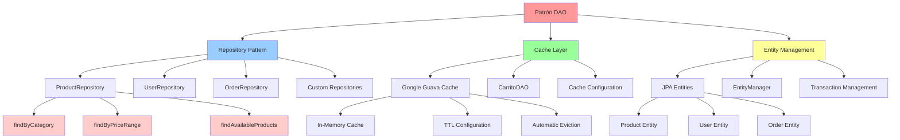

# Patrón DAO - Data Access Object

## Descripción General

El patrón DAO (Data Access Object) proporciona una interfaz abstracta para acceder a datos desde diferentes fuentes de datos como bases de datos, archivos, servicios web, etc. En el sistema "Como en Casa", este patrón se implementa principalmente a través de Spring Data JPA con repositorios personalizados y un sistema de caché usando Google Guava para optimizar las operaciones del carrito de compras.

## Diagrama de Implementación



## Implementación del Patrón DAO

### 1. Spring Data JPA Repositories

El patrón DAO se implementa principalmente a través de Spring Data JPA repositories.

**Ejemplo: ProductRepository**

```java
@Repository
public interface ProductRepository extends JpaRepository<Product, Long> {

    // Consultas derivadas del nombre del método
    List<Product> findByNameContainingIgnoreCase(String name);

    List<Product> findByCategoryIgnoreCase(String category);

    List<Product> findByAvailableTrue();

    List<Product> findByPriceBetween(BigDecimal minPrice, BigDecimal maxPrice);

    // Consulta personalizada con @Query
    @Query("SELECT p FROM Product p WHERE p.stock > :minStock AND p.available = true")
    List<Product> findProductsWithStock(@Param("minStock") Integer minStock);

    // Consulta nativa para casos complejos
    @Query(value = "SELECT * FROM products p WHERE p.created_at >= :dateFrom " +
                   "AND p.stock > 0 ORDER BY p.created_at DESC",
           nativeQuery = true)
    List<Product> findRecentProductsWithStock(@Param("dateFrom") LocalDateTime dateFrom);

    // Consultas con proyecciones
    @Query("SELECT new com.comoencasa_backend.dto.ProductSummaryDTO(p.id, p.name, p.price) " +
           "FROM Product p WHERE p.category = :category")
    List<ProductSummaryDTO> findProductSummaryByCategory(@Param("category") String category);

    // Consultas de agregación
    @Query("SELECT COUNT(p) FROM Product p WHERE p.category = :category")
    Long countByCategory(@Param("category") String category);

    @Query("SELECT AVG(p.price) FROM Product p WHERE p.available = true")
    BigDecimal findAveragePrice();
}
```

**Ejemplo: UserRepository**

```java
@Repository
public interface UserRepository extends JpaRepository<User, Long> {

    Optional<User> findByEmail(String email);

    boolean existsByEmail(String email);

    List<User> findByRole(UserRole role);

    List<User> findByEnabledTrue();

    @Query("SELECT u FROM User u WHERE u.createdAt >= :startDate AND u.createdAt <= :endDate")
    List<User> findUsersByDateRange(@Param("startDate") LocalDateTime startDate,
                                   @Param("endDate") LocalDateTime endDate);

    @Modifying
    @Query("UPDATE User u SET u.enabled = :enabled WHERE u.id = :userId")
    int updateUserStatus(@Param("userId") Long userId, @Param("enabled") boolean enabled);
}
```

**Ejemplo: OrderRepository**

```java
@Repository
public interface OrderRepository extends JpaRepository<Order, Long> {

    List<Order> findByUserId(Long userId);

    List<Order> findByStatus(OrderStatus status);

    List<Order> findByOrderDateBetween(LocalDateTime startDate, LocalDateTime endDate);

    @Query("SELECT o FROM Order o WHERE o.user.id = :userId AND o.status = :status")
    List<Order> findByUserIdAndStatus(@Param("userId") Long userId,
                                     @Param("status") OrderStatus status);

    @Query("SELECT SUM(o.total) FROM Order o WHERE o.orderDate >= :startDate")
    BigDecimal calculateRevenueFromDate(@Param("startDate") LocalDateTime startDate);

    @Query("SELECT o FROM Order o JOIN FETCH o.items WHERE o.id = :orderId")
    Optional<Order> findByIdWithItems(@Param("orderId") Long orderId);
}
```

### 2. Custom Repository Implementation

Para operaciones complejas, se implementan repositorios personalizados.

**Ejemplo: ProductRepositoryCustom**

```java
public interface ProductRepositoryCustom {
    List<Product> findProductsWithComplexCriteria(ProductSearchCriteria criteria);
    Page<Product> findProductsWithPagination(ProductSearchCriteria criteria, Pageable pageable);
    List<ProductStatistics> getProductStatistics();
}

@Repository
public class ProductRepositoryCustomImpl implements ProductRepositoryCustom {

    @PersistenceContext
    private EntityManager entityManager;

    @Override
    public List<Product> findProductsWithComplexCriteria(ProductSearchCriteria criteria) {
        CriteriaBuilder cb = entityManager.getCriteriaBuilder();
        CriteriaQuery<Product> query = cb.createQuery(Product.class);
        Root<Product> root = query.from(Product.class);

        List<Predicate> predicates = new ArrayList<>();

        // Filtro por nombre
        if (criteria.getName() != null && !criteria.getName().isEmpty()) {
            predicates.add(cb.like(cb.lower(root.get("name")),
                                 "%" + criteria.getName().toLowerCase() + "%"));
        }

        // Filtro por rango de precios
        if (criteria.getMinPrice() != null) {
            predicates.add(cb.greaterThanOrEqualTo(root.get("price"), criteria.getMinPrice()));
        }
        if (criteria.getMaxPrice() != null) {
            predicates.add(cb.lessThanOrEqualTo(root.get("price"), criteria.getMaxPrice()));
        }

        // Filtro por categoría
        if (criteria.getCategory() != null) {
            predicates.add(cb.equal(root.get("category"), criteria.getCategory()));
        }

        // Filtro por disponibilidad
        if (criteria.getAvailable() != null) {
            predicates.add(cb.equal(root.get("available"), criteria.getAvailable()));
        }

        // Aplicar predicados
        query.where(predicates.toArray(new Predicate[0]));

        // Ordenamiento
        if (criteria.getSortBy() != null) {
            if (criteria.getSortDirection() == SortDirection.ASC) {
                query.orderBy(cb.asc(root.get(criteria.getSortBy())));
            } else {
                query.orderBy(cb.desc(root.get(criteria.getSortBy())));
            }
        }

        return entityManager.createQuery(query).getResultList();
    }

    @Override
    public Page<Product> findProductsWithPagination(ProductSearchCriteria criteria, Pageable pageable) {
        // Implementación similar con paginación
        CriteriaBuilder cb = entityManager.getCriteriaBuilder();
        CriteriaQuery<Product> query = cb.createQuery(Product.class);
        Root<Product> root = query.from(Product.class);

        // ... lógica de filtros ...

        TypedQuery<Product> typedQuery = entityManager.createQuery(query);
        typedQuery.setFirstResult((int) pageable.getOffset());
        typedQuery.setMaxResults(pageable.getPageSize());

        List<Product> products = typedQuery.getResultList();

        // Contar total de elementos
        CriteriaQuery<Long> countQuery = cb.createQuery(Long.class);
        countQuery.select(cb.count(countQuery.from(Product.class)));
        Long total = entityManager.createQuery(countQuery).getSingleResult();

        return new PageImpl<>(products, pageable, total);
    }

    @Override
    public List<ProductStatistics> getProductStatistics() {
        String jpql = """
            SELECT new com.comoencasa_backend.dto.ProductStatistics(
                p.category,
                COUNT(p),
                AVG(p.price),
                SUM(p.stock)
            )
            FROM Product p
            WHERE p.available = true
            GROUP BY p.category
            ORDER BY COUNT(p) DESC
            """;

        return entityManager.createQuery(jpql, ProductStatistics.class).getResultList();
    }
}
```

### 3. Cache Layer con Google Guava

Implementación de caché para operaciones frecuentes como el carrito de compras.

**Ejemplo: CarritoDAO**

```java
@Component
@Slf4j
public class CarritoDAO {

    private final Cache<String, List<CarritoItemDTO>> carritoCache;
    private final ProductRepository productRepository;

    public CarritoDAO(ProductRepository productRepository) {
        this.productRepository = productRepository;
        this.carritoCache = CacheBuilder.newBuilder()
                .maximumSize(1000)
                .expireAfterWrite(30, TimeUnit.MINUTES)
                .expireAfterAccess(15, TimeUnit.MINUTES)
                .removalListener((RemovalListener<String, List<CarritoItemDTO>>) notification -> {
                    log.info("Carrito removido del cache: {} - Causa: {}",
                            notification.getKey(), notification.getCause());
                })
                .build();
    }

    public List<CarritoItemDTO> obtenerCarrito(String carritoId) {
        try {
            return carritoCache.get(carritoId, () -> {
                log.info("Creando nuevo carrito en cache para: {}", carritoId);
                return new ArrayList<>();
            });
        } catch (ExecutionException e) {
            log.error("Error al obtener carrito del cache", e);
            return new ArrayList<>();
        }
    }

    public void agregarItem(String carritoId, CarritoItemDTO item) {
        List<CarritoItemDTO> items = obtenerCarrito(carritoId);

        // Verificar si el producto ya existe en el carrito
        Optional<CarritoItemDTO> existingItem = items.stream()
                .filter(i -> i.getProductoId().equals(item.getProductoId()))
                .findFirst();

        if (existingItem.isPresent()) {
            // Actualizar cantidad
            CarritoItemDTO existing = existingItem.get();
            existing.setCantidad(existing.getCantidad() + item.getCantidad());
            existing.setSubtotal(existing.getPrecioVenta() * existing.getCantidad());
        } else {
            // Agregar nuevo item
            items.add(item);
        }

        carritoCache.put(carritoId, items);
        log.info("Item agregado al carrito {}: Producto {} - Cantidad {}",
                carritoId, item.getProductoId(), item.getCantidad());
    }

    public void actualizarCantidad(String carritoId, Long productoId, Integer nuevaCantidad) {
        List<CarritoItemDTO> items = obtenerCarrito(carritoId);

        items.stream()
                .filter(item -> item.getProductoId().equals(productoId))
                .findFirst()
                .ifPresent(item -> {
                    item.setCantidad(nuevaCantidad);
                    item.setSubtotal(item.getPrecioVenta() * nuevaCantidad);
                });

        carritoCache.put(carritoId, items);
        log.info("Cantidad actualizada en carrito {}: Producto {} - Nueva cantidad {}",
                carritoId, productoId, nuevaCantidad);
    }

    public void eliminarItem(String carritoId, Long productoId) {
        List<CarritoItemDTO> items = obtenerCarrito(carritoId);
        items.removeIf(item -> item.getProductoId().equals(productoId));
        carritoCache.put(carritoId, items);
        log.info("Item eliminado del carrito {}: Producto {}", carritoId, productoId);
    }

    public void limpiarCarrito(String carritoId) {
        carritoCache.invalidate(carritoId);
        log.info("Carrito limpiado: {}", carritoId);
    }

    public Double calcularTotal(String carritoId) {
        List<CarritoItemDTO> items = obtenerCarrito(carritoId);
        return items.stream()
                .mapToDouble(CarritoItemDTO::getSubtotal)
                .sum();
    }

    public int obtenerCantidadItems(String carritoId) {
        List<CarritoItemDTO> items = obtenerCarrito(carritoId);
        return items.stream()
                .mapToInt(CarritoItemDTO::getCantidad)
                .sum();
    }

    public CacheStats obtenerEstadisticasCache() {
        return carritoCache.stats();
    }
}
```

### 4. Service Layer con DAO

Los servicios utilizan los DAOs para encapsular la lógica de negocio.

**Ejemplo: ProductService**

```java
@Service
@Slf4j
@Transactional
public class ProductService {

    private final ProductRepository productRepository;
    private final ProductMapper productMapper;
    private final ProductRepositoryCustom productRepositoryCustom;

    public ProductService(ProductRepository productRepository,
                         ProductMapper productMapper,
                         ProductRepositoryCustom productRepositoryCustom) {
        this.productRepository = productRepository;
        this.productMapper = productMapper;
        this.productRepositoryCustom = productRepositoryCustom;
    }

    @Transactional(readOnly = true)
    public List<ProductDTO> getAllProducts() {
        List<Product> products = productRepository.findAll();
        return products.stream()
                .map(productMapper::toDTO)
                .collect(Collectors.toList());
    }

    @Transactional(readOnly = true)
    public Optional<ProductDTO> getProductById(Long id) {
        return productRepository.findById(id)
                .map(productMapper::toDTO);
    }

    @Transactional(readOnly = true)
    public List<ProductDTO> searchProducts(String name) {
        List<Product> products = productRepository.findByNameContainingIgnoreCase(name);
        return products.stream()
                .map(productMapper::toDTO)
                .collect(Collectors.toList());
    }

    @Transactional(readOnly = true)
    public List<ProductDTO> getProductsByCategory(String category) {
        List<Product> products = productRepository.findByCategoryIgnoreCase(category);
        return products.stream()
                .map(productMapper::toDTO)
                .collect(Collectors.toList());
    }

    @Transactional(readOnly = true)
    public Page<ProductDTO> getProductsWithPagination(ProductSearchCriteria criteria, Pageable pageable) {
        Page<Product> products = productRepositoryCustom.findProductsWithPagination(criteria, pageable);
        return products.map(productMapper::toDTO);
    }

    public ProductDTO createProduct(ProductDTO productDTO) {
        Product product = productMapper.toEntity(productDTO);
        product.setCreatedAt(LocalDateTime.now());
        product.setAvailable(true);

        Product savedProduct = productRepository.save(product);
        log.info("Producto creado: {} - ID: {}", savedProduct.getName(), savedProduct.getId());

        return productMapper.toDTO(savedProduct);
    }

    public ProductDTO updateProduct(Long id, ProductDTO productDTO) {
        Product existingProduct = productRepository.findById(id)
                .orElseThrow(() -> new ProductNotFoundException("Producto no encontrado: " + id));

        // Actualizar campos
        existingProduct.setName(productDTO.getName());
        existingProduct.setDescription(productDTO.getDescription());
        existingProduct.setPrice(productDTO.getPrice());
        existingProduct.setStock(productDTO.getStock());
        existingProduct.setCategory(productDTO.getCategory());
        existingProduct.setImageUrl(productDTO.getImageUrl());
        existingProduct.setUpdatedAt(LocalDateTime.now());

        Product updatedProduct = productRepository.save(existingProduct);
        log.info("Producto actualizado: {} - ID: {}", updatedProduct.getName(), updatedProduct.getId());

        return productMapper.toDTO(updatedProduct);
    }

    public void deleteProduct(Long id) {
        if (!productRepository.existsById(id)) {
            throw new ProductNotFoundException("Producto no encontrado: " + id);
        }

        productRepository.deleteById(id);
        log.info("Producto eliminado: ID {}", id);
    }

    @Transactional(readOnly = true)
    public List<ProductStatistics> getProductStatistics() {
        return productRepositoryCustom.getProductStatistics();
    }
}
```

### 5. Entity Mapping y DTOs

**Ejemplo: ProductMapper**

```java
@Component
public class ProductMapper {

    public ProductDTO toDTO(Product product) {
        if (product == null) {
            return null;
        }

        return ProductDTO.builder()
                .id(product.getId())
                .name(product.getName())
                .description(product.getDescription())
                .price(product.getPrice())
                .stock(product.getStock())
                .category(product.getCategory())
                .imageUrl(product.getImageUrl())
                .available(product.getAvailable())
                .createdAt(product.getCreatedAt())
                .updatedAt(product.getUpdatedAt())
                .build();
    }

    public Product toEntity(ProductDTO productDTO) {
        if (productDTO == null) {
            return null;
        }

        return Product.builder()
                .id(productDTO.getId())
                .name(productDTO.getName())
                .description(productDTO.getDescription())
                .price(productDTO.getPrice())
                .stock(productDTO.getStock())
                .category(productDTO.getCategory())
                .imageUrl(productDTO.getImageUrl())
                .available(productDTO.getAvailable())
                .createdAt(productDTO.getCreatedAt())
                .updatedAt(productDTO.getUpdatedAt())
                .build();
    }

    public List<ProductDTO> toDTOList(List<Product> products) {
        return products.stream()
                .map(this::toDTO)
                .collect(Collectors.toList());
    }
}
```

### 6. Transaction Management

**Ejemplo: OrderService con transacciones**

```java
@Service
@Slf4j
@Transactional
public class OrderService {

    private final OrderRepository orderRepository;
    private final ProductRepository productRepository;
    private final CarritoDAO carritoDAO;
    private final OrderMapper orderMapper;

    public OrderService(OrderRepository orderRepository,
                       ProductRepository productRepository,
                       CarritoDAO carritoDAO,
                       OrderMapper orderMapper) {
        this.orderRepository = orderRepository;
        this.productRepository = productRepository;
        this.carritoDAO = carritoDAO;
        this.orderMapper = orderMapper;
    }

    @Transactional
    public OrderDTO createOrder(String carritoId, CreateOrderRequest request) {
        // Obtener items del carrito
        List<CarritoItemDTO> carritoItems = carritoDAO.obtenerCarrito(carritoId);

        if (carritoItems.isEmpty()) {
            throw new EmptyCartException("El carrito está vacío");
        }

        // Validar stock disponible
        for (CarritoItemDTO item : carritoItems) {
            Product product = productRepository.findById(item.getProductoId())
                    .orElseThrow(() -> new ProductNotFoundException("Producto no encontrado: " + item.getProductoId()));

            if (product.getStock() < item.getCantidad()) {
                throw new InsufficientStockException("Stock insuficiente para: " + product.getName());
            }
        }

        // Crear orden
        Order order = Order.builder()
                .userId(request.getUserId())
                .orderDate(LocalDateTime.now())
                .status(OrderStatus.PENDING)
                .total(carritoDAO.calcularTotal(carritoId))
                .shippingAddress(request.getShippingAddress())
                .paymentMethod(request.getPaymentMethod())
                .build();

        // Crear items de la orden
        List<OrderItem> orderItems = carritoItems.stream()
                .map(carritoItem -> OrderItem.builder()
                        .productId(carritoItem.getProductoId())
                        .productName(carritoItem.getNombre())
                        .quantity(carritoItem.getCantidad())
                        .price(BigDecimal.valueOf(carritoItem.getPrecioVenta()))
                        .subtotal(BigDecimal.valueOf(carritoItem.getSubtotal()))
                        .build())
                .collect(Collectors.toList());

        order.setItems(orderItems);

        // Guardar orden
        Order savedOrder = orderRepository.save(order);

        // Actualizar stock de productos
        for (CarritoItemDTO item : carritoItems) {
            Product product = productRepository.findById(item.getProductoId()).get();
            product.setStock(product.getStock() - item.getCantidad());
            productRepository.save(product);
        }

        // Limpiar carrito
        carritoDAO.limpiarCarrito(carritoId);

        log.info("Orden creada exitosamente: ID {}", savedOrder.getId());
        return orderMapper.toDTO(savedOrder);
    }

    @Transactional(readOnly = true)
    public List<OrderDTO> getOrdersByUser(Long userId) {
        List<Order> orders = orderRepository.findByUserId(userId);
        return orders.stream()
                .map(orderMapper::toDTO)
                .collect(Collectors.toList());
    }
}
```

## Ventajas de la Implementación DAO

### 📊 **Separación de Responsabilidades**

- Separación clara entre lógica de negocio y acceso a datos
- Servicios enfocados en reglas de negocio
- Repositorios enfocados en operaciones de datos

### 🚀 **Performance y Caching**

- Cache inteligente con Google Guava
- Consultas optimizadas con JPA
- Paginación eficiente para grandes datasets

### 🔧 **Mantenibilidad**

- Consultas centralizadas en repositorios
- Fácil testing con repositorios mockeados
- Código reutilizable y modular

### 📈 **Escalabilidad**

- Soporte para múltiples fuentes de datos
- Configuración flexible de cache
- Transacciones distribuidas

## Configuración y Mejores Prácticas

### Cache Configuration

```java
@Configuration
public class CacheConfiguration {

    @Bean
    public CacheManager cacheManager() {
        GuavaCacheManager cacheManager = new GuavaCacheManager();
        cacheManager.setCacheBuilder(
            CacheBuilder.newBuilder()
                .maximumSize(1000)
                .expireAfterWrite(30, TimeUnit.MINUTES)
                .recordStats()
        );
        return cacheManager;
    }
}
```

### Repository Testing

```java
@DataJpaTest
class ProductRepositoryTest {

    @Autowired
    private TestEntityManager entityManager;

    @Autowired
    private ProductRepository productRepository;

    @Test
    void testFindByCategory() {
        // Given
        Product product = Product.builder()
                .name("Test Product")
                .category("Test Category")
                .price(BigDecimal.valueOf(10.99))
                .stock(100)
                .available(true)
                .build();

        entityManager.persistAndFlush(product);

        // When
        List<Product> products = productRepository.findByCategoryIgnoreCase("test category");

        // Then
        assertThat(products).hasSize(1);
        assertThat(products.get(0).getName()).isEqualTo("Test Product");
    }
}
```

## Patrones Complementarios

El patrón DAO se complementa con:

- **Repository Pattern**: Implementación específica de DAO
- **Unit of Work**: Manejo de transacciones
- **Identity Map**: Cache de entidades
- **Lazy Loading**: Carga diferida de relaciones
- **Active Record**: Alternativa simplificada

Esta implementación del patrón DAO en "Como en Casa" proporciona una base sólida para el acceso a datos, combinando las ventajas de Spring Data JPA con optimizaciones de performance a través de caché inteligente.
