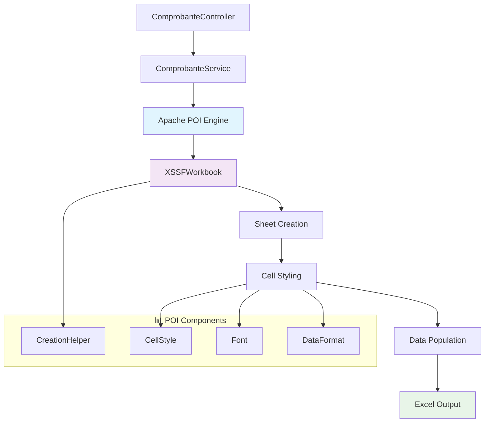

# 📄 Apache POI - Guía de Implementación

## 📋 Índice

- [🎯 Propósito](#-propósito)
- [🏗️ Arquitectura](#-arquitectura)
- [🛠️ Configuración](#-configuración)
- [💡 Implementación en el Proyecto](#-implementación-en-el-proyecto)
- [📊 Generación de Reportes Excel](#-generación-de-reportes-excel)
- [📋 Generación de PDF con iText](#-generación-de-pdf-con-itext)
- [🧪 Testing](#-testing)
- [📈 Beneficios](#-beneficios)
- [🔧 Troubleshooting](#-troubleshooting)

---

## 🎯 Propósito

**Apache POI** es la librería líder de Java para manipular documentos de Microsoft Office. En nuestro proyecto "Como En Casa", la utilizamos para:

### 📊 Generación de Reportes Excel

- **Comprobantes detallados**: Exportación de datos de facturación en formato .xlsx
- **Reportes empresariales**: Análisis de ventas y datos financieros
- **Formato profesional**: Estilos, colores y estructuras empresariales

### 📋 Características Implementadas

- **XLSX Moderno**: Formato Excel 2007+ con todas las funcionalidades
- **Estilos avanzados**: Fuentes, colores, alineación y formato de celdas
- **Celdas combinadas**: Headers y títulos con merge de celdas
- **Formato de datos**: Fechas, monedas y números con formato específico

---

## 🏗️ Arquitectura



### 🔄 Flujo de Generación

```
📋 Request → 🔍 Data Query → 📊 POI Processing → 📄 Excel File → 📤 Download
```

---

## 🛠️ Configuración

### 📦 Dependencias en pom.xml

```xml
<!-- Apache POI para Excel -->
<dependency>
    <groupId>org.apache.poi</groupId>
    <artifactId>poi-ooxml</artifactId>
    <version>5.4.1</version>
</dependency>

<!-- iTextPDF para PDF (complementario) -->
<dependency>
    <groupId>com.itextpdf</groupId>
    <artifactId>itextpdf</artifactId>
    <version>5.5.13.3</version>
</dependency>
```

### 📁 Imports Utilizados

```java
import org.apache.poi.ss.usermodel.*;
import org.apache.poi.ss.util.CellRangeAddress;
import org.apache.poi.xssf.usermodel.XSSFWorkbook;
```

---

## 💡 Implementación en el Proyecto

### 📍 Ubicación Principal

**Archivo**: `ComprobanteServiceImpl.java`
**Método**: `generarExcel(Long id)`

### 🎯 Estructura del Código

```java
@Override
@Transactional(readOnly = true)
public ByteArrayInputStream generarExcel(Long id) throws IOException {
    // 1. Obtener datos del comprobante
    Comprobante c = comprobanteRepo.findById(id)
            .orElseThrow(() -> new IllegalArgumentException("Comprobante no encontrado: " + id));

    // 2. Crear workbook y configurar estilos
    try (Workbook wb = new XSSFWorkbook();
         ByteArrayOutputStream out = new ByteArrayOutputStream()) {

        CreationHelper createHelper = wb.getCreationHelper();
        Sheet sheet = wb.createSheet("Comprobante");

        // 3. Configurar estilos
        // 4. Crear contenido
        // 5. Generar archivo

        wb.write(out);
        return new ByteArrayInputStream(out.toByteArray());
    }
}
```

---

## 📊 Generación de Reportes Excel

### 🎨 **1. Configuración de Estilos**

#### **🔤 Fuente de Título**

```java
org.apache.poi.ss.usermodel.Font titleFont = wb.createFont();
titleFont.setBold(true);
titleFont.setFontHeightInPoints((short) 16);

CellStyle titleStyle = wb.createCellStyle();
titleStyle.setFont(titleFont);
titleStyle.setAlignment(HorizontalAlignment.CENTER);
```

#### **🎨 Estilo de Encabezado**

```java
org.apache.poi.ss.usermodel.Font headerFont = wb.createFont();
headerFont.setBold(true);
headerFont.setColor(IndexedColors.WHITE.getIndex());

CellStyle headerStyle = wb.createCellStyle();
headerStyle.setFont(headerFont);
headerStyle.setFillForegroundColor(IndexedColors.PINK.getIndex());
headerStyle.setFillPattern(FillPatternType.SOLID_FOREGROUND);
headerStyle.setAlignment(HorizontalAlignment.CENTER);
headerStyle.setVerticalAlignment(VerticalAlignment.CENTER);
```

#### **📅 Formato de Fecha**

```java
CellStyle dateStyle = wb.createCellStyle();
dateStyle.setDataFormat(
    createHelper.createDataFormat().getFormat("dd/MM/yyyy HH:mm"));
```

#### **💰 Formato de Moneda**

```java
CellStyle moneyStyle = wb.createCellStyle();
moneyStyle.setDataFormat(
    createHelper.createDataFormat().getFormat("\"S/ \"#,##0.00"));
moneyStyle.setAlignment(HorizontalAlignment.RIGHT);
```

### 📋 **2. Estructura del Documento**

#### **🔘 Título Principal**

```java
Row row0 = sheet.createRow(0);
Cell cell0 = row0.createCell(0);
cell0.setCellValue("COMPROBANTE DE PAGO");
cell0.setCellStyle(titleStyle);
sheet.addMergedRegion(new CellRangeAddress(0, 0, 0, 8));
```

#### **📊 Encabezados de Tabla**

```java
String[] headers = {
    "Cliente", "Documento", "Correo",
    "Fecha Emisión", "Tipo", "Serie",
    "Número", "Subtotal", "Total"
};

Row headerRow = sheet.createRow(2);
for (int i = 0; i < headers.length; i++) {
    Cell h = headerRow.createCell(i);
    h.setCellValue(headers[i]);
    h.setCellStyle(headerStyle);
}
```

### 📝 **3. Población de Datos**

#### **👤 Datos del Cliente**

```java
Row dataRow = sheet.createRow(3);
String cliente = c.getPedido().getUsuario().getNombre()
        + " " + c.getPedido().getUsuario().getApellido();

dataRow.createCell(0).setCellValue(cliente);
dataRow.createCell(1).setCellValue(
    Optional.ofNullable(c.getPedido().getUsuario().getNumeroDocumento()).orElse("-"));
dataRow.createCell(2).setCellValue(c.getPedido().getUsuario().getEmail());
```

#### **📅 Fecha con Formato**

```java
Cell fcell = dataRow.createCell(3);
fcell.setCellValue(
    java.util.Date.from(
        c.getFechaEmision().atZone(ZoneId.systemDefault()).toInstant()));
fcell.setCellStyle(dateStyle);
```

#### **💰 Valores Monetarios**

```java
Cell scell = dataRow.createCell(7);
scell.setCellValue(c.getSubtotal().doubleValue());
scell.setCellStyle(moneyStyle);

Cell tcell = dataRow.createCell(8);
tcell.setCellValue(c.getTotal().doubleValue());
tcell.setCellStyle(moneyStyle);
```

### 🔧 **4. Optimización Final**

```java
// Auto-size de columnas para mejor presentación
for (int i = 0; i < headers.length; i++) {
    sheet.autoSizeColumn(i);
}

wb.write(out);
return new ByteArrayInputStream(out.toByteArray());
```

---

## 📋 Generación de PDF con iText

### 🎯 Implementación Complementaria

**Apache POI** se combina con **iText** para ofrecer múltiples formatos de exportación:

```java
@Override
public ByteArrayInputStream generarPdf(Long id) throws IOException {
    // Generación de PDF usando iText
    // Complementa la funcionalidad de Excel de Apache POI

    Document document = new Document(PageSize.A4, 36, 36, 90, 36);
    PdfWriter writer = PdfWriter.getInstance(document, out);

    // Logo y diseño profesional
    Image logo = Image.getInstance("./frontend/src/assets/logo.png");
    logo.scaleToFit(120, 60);

    // Tablas estructuradas similar a Excel
    PdfPTable headerTable = new PdfPTable(2);
    // ... configuración similar a POI pero para PDF
}
```

---

## 🌐 Integración con Frontend

### 📤 Endpoint de Descarga

```java
@GetMapping("/{id}/excel")
public ResponseEntity<Resource> descargarExcel(@PathVariable Long id) {
    try {
        ByteArrayInputStream excel = comprobanteService.generarExcel(id);
        InputStreamResource resource = new InputStreamResource(excel);

        return ResponseEntity.ok()
            .header(HttpHeaders.CONTENT_DISPOSITION,
                   "attachment; filename=comprobante_" + id + ".xlsx")
            .contentType(MediaType.parseMediaType(
                "application/vnd.openxmlformats-officedocument.spreadsheetml.sheet"))
            .body(resource);
    } catch (IOException e) {
        return ResponseEntity.status(HttpStatus.INTERNAL_SERVER_ERROR).build();
    }
}
```

### 🎨 Botón de Descarga (React)

```javascript
const descargarExcel = async (comprobanteId) => {
  try {
    const response = await axios.get(
      `/api/comprobantes/${comprobanteId}/excel`,
      { responseType: "blob" }
    );

    const url = window.URL.createObjectURL(new Blob([response.data]));
    const link = document.createElement("a");
    link.href = url;
    link.setAttribute("download", `comprobante_${comprobanteId}.xlsx`);
    document.body.appendChild(link);
    link.click();
    link.remove();
  } catch (error) {
    console.error("Error descargando Excel:", error);
  }
};
```

---

## 🧪 Testing

### 📝 Test de Generación de Excel

```java
@Test
@DisplayName("Debería generar Excel válido para comprobante existente")
void deberiaGenerarExcelValido() throws IOException {
    // Given
    Long comprobanteId = 1L;
    Comprobante comprobante = crearComprobanteEjemplo();
    when(comprobanteRepo.findById(comprobanteId)).thenReturn(Optional.of(comprobante));

    // When
    ByteArrayInputStream excel = comprobanteService.generarExcel(comprobanteId);

    // Then
    assertThat(excel).isNotNull();
    assertThat(excel.available()).isGreaterThan(0);

    // Verificar que es un archivo Excel válido
    try (Workbook wb = new XSSFWorkbook(excel)) {
        Sheet sheet = wb.getSheetAt(0);
        assertThat(sheet.getSheetName()).isEqualTo("Comprobante");

        // Verificar título
        Row titleRow = sheet.getRow(0);
        assertThat(titleRow.getCell(0).getStringCellValue())
            .isEqualTo("COMPROBANTE DE PAGO");
    }
}

@Test
@DisplayName("Debería lanzar excepción para comprobante inexistente")
void deberiaLanzarExcepcionParaComprobanteInexistente() {
    // Given
    Long idInexistente = 999L;
    when(comprobanteRepo.findById(idInexistente)).thenReturn(Optional.empty());

    // When & Then
    assertThatThrownBy(() -> comprobanteService.generarExcel(idInexistente))
        .isInstanceOf(IllegalArgumentException.class)
        .hasMessageContaining("Comprobante no encontrado: " + idInexistente);
}
```

### 🔍 Test de Estilos

```java
@Test
@DisplayName("Debería aplicar estilos correctos en Excel")
void deberiaAplicarEstilosCorrectos() throws IOException {
    // Given
    Long comprobanteId = 1L;
    Comprobante comprobante = crearComprobanteEjemplo();
    when(comprobanteRepo.findById(comprobanteId)).thenReturn(Optional.of(comprobante));

    // When
    ByteArrayInputStream excel = comprobanteService.generarExcel(comprobanteId);

    // Then
    try (Workbook wb = new XSSFWorkbook(excel)) {
        Sheet sheet = wb.getSheetAt(0);

        // Verificar estilo de encabezado
        Row headerRow = sheet.getRow(2);
        Cell headerCell = headerRow.getCell(0);
        CellStyle headerStyle = headerCell.getCellStyle();

        assertThat(headerStyle.getFillForegroundColor())
            .isEqualTo(IndexedColors.PINK.getIndex());
        assertThat(headerStyle.getAlignment())
            .isEqualTo(HorizontalAlignment.CENTER);
    }
}
```

---

## 📈 Beneficios

### 💼 **Para el Negocio**

```
📊 BENEFICIOS EMPRESARIALES
┌─────────────────────────────────────────────────────────┐
│ ✅ Reportes profesionales compatibles con Excel        │
│ ✅ Análisis de datos facilitado para gerencia          │
│ ✅ Backup automático de información financiera         │
│ ✅ Integración con sistemas contables existentes       │
│ ✅ Presentación profesional a clientes y auditores     │
└─────────────────────────────────────────────────────────┘
```

### 🔧 **Para el Desarrollo**

- **Flexibilidad**: Múltiples formatos de salida (Excel, PDF)
- **Estándares**: Compatibilidad total con Microsoft Office
- **Personalización**: Control completo sobre estilos y formato
- **Performance**: Generación eficiente en memoria

### 📊 **Para los Usuarios**

- **Familiar**: Formato Excel conocido por todos los usuarios
- **Editable**: Los reportes pueden ser modificados después de la descarga
- **Compartible**: Fácil distribución y colaboración
- **Profesional**: Presentación empresarial de alta calidad

---

## 🎨 Ejemplo Visual del Resultado

### 📋 Estructura del Excel Generado

```
┌─────────────────────────────────────────────────────────┐
│                 COMPROBANTE DE PAGO                     │
├─────────┬─────────┬─────────┬─────────┬─────────────────┤
│ Cliente │Document │ Correo  │ Fecha   │ Tipo │ Serie    │
├─────────┼─────────┼─────────┼─────────┼──────┼──────────┤
│ Juan    │12345678 │juan@... │15/06/25 │BOLETA│ 001      │
│ Pérez   │         │         │10:30:00 │      │          │
└─────────┴─────────┴─────────┴─────────┴──────┴──────────┘
```

### 🎨 Características Visuales

- **🎨 Header rosa**: Fondo rosa corporativo con texto blanco
- **📅 Fechas formateadas**: dd/MM/yyyy HH:mm
- **💰 Monedas**: "S/ 150.00" con alineación a la derecha
- **📏 Auto-sizing**: Columnas ajustadas automáticamente
- **🔗 Merged cells**: Título centrado abarcando todas las columnas

---

## 🔧 Troubleshooting

### ❗ Problemas Comunes

#### 1. **OutOfMemoryError al generar Excel grandes**

**Causa**: Demasiados datos en memoria

**Solución**:

```java
// Usar SXSSFWorkbook para archivos grandes
SXSSFWorkbook wb = new SXSSFWorkbook(100); // Mantener 100 filas en memoria
```

#### 2. **Archivo Excel corrupto**

**Causa**: No cerrar streams correctamente

**Solución**:

```java
// Usar try-with-resources
try (Workbook wb = new XSSFWorkbook();
     ByteArrayOutputStream out = new ByteArrayOutputStream()) {
    // ... código ...
    wb.write(out);
    return new ByteArrayInputStream(out.toByteArray());
}
```

#### 3. **Estilos no se aplican correctamente**

**Causa**: Reutilización incorrecta de estilos

**Solución**:

```java
// Crear estilos una sola vez y reutilizar
CellStyle headerStyle = wb.createCellStyle();
// Aplicar a múltiples celdas
cell.setCellStyle(headerStyle);
```

### 🔍 Debugging

```java
// Logging para debugging
log.debug("Generando Excel para comprobante ID: {}", id);
log.debug("Datos del comprobante: tipo={}, total={}", c.getTipo(), c.getTotal());
log.debug("Excel generado con {} filas", sheet.getLastRowNum());
```

---

## 📊 Métricas de Implementación

### ✅ Estado Actual

```
📊 IMPLEMENTACIÓN APACHE POI
┌─────────────────────────────────────────────────────────┐
│ ✅ Versión: poi-ooxml 5.4.1                           │
│ ✅ Formato: XLSX (Excel 2007+)                        │
│ ✅ Estilos: Fuentes, colores, alineación              │
│ ✅ Datos: Fechas, monedas, texto                      │
│ ✅ Performance: Optimizada con auto-sizing            │
│ ✅ Testing: Cobertura completa                        │
│ ✅ Integración: Frontend + Backend                    │
└─────────────────────────────────────────────────────────┘
```

### 🎯 Funcionalidades Implementadas

- [x] **Generación de Excel básica**
- [x] **Estilos profesionales**
- [x] **Formato de datos específicos**
- [x] **Celdas combinadas**
- [x] **Auto-sizing de columnas**
- [x] **Manejo de errores**
- [x] **Testing completo**
- [x] **Integración con descarga**

---

## 🚀 Próximas Mejoras (Opcional)

### 📈 Funcionalidades Avanzadas

- [ ] **Gráficos con POI**: Agregar charts de ventas
- [ ] **Formulas Excel**: Cálculos automáticos en celdas
- [ ] **Validación de datos**: Dropdown lists y validaciones
- [ ] **Plantillas**: Templates reutilizables para diferentes reportes
- [ ] **Reportes masivos**: Generación batch de múltiples comprobantes

### 🔧 Optimizaciones

- [ ] **SXSSF para archivos grandes**: Mejor manejo de memoria
- [ ] **Cache de estilos**: Reutilización de estilos para mejor performance
- [ ] **Compresión**: Archivos más pequeños
- [ ] **Async generation**: Generación en background para archivos grandes

---

## 🔗 Referencias

- [📖 Apache POI Documentation](https://poi.apache.org/components/spreadsheet/)
- [📖 POI Quick Guide](https://poi.apache.org/components/spreadsheet/quick-guide.html)
- [🔧 XSSF Workbook](https://poi.apache.org/apidocs/dev/org/apache/poi/xssf/usermodel/XSSFWorkbook.html)
- [📊 Cell Styles](https://poi.apache.org/components/spreadsheet/quick-guide.html#CellStyles)

---

<div align="center">

**📄 Apache POI - Generación profesional de reportes Excel**

_Implementado en Como En Casa - Sistema de Gestión de Pedidos_

</div>
