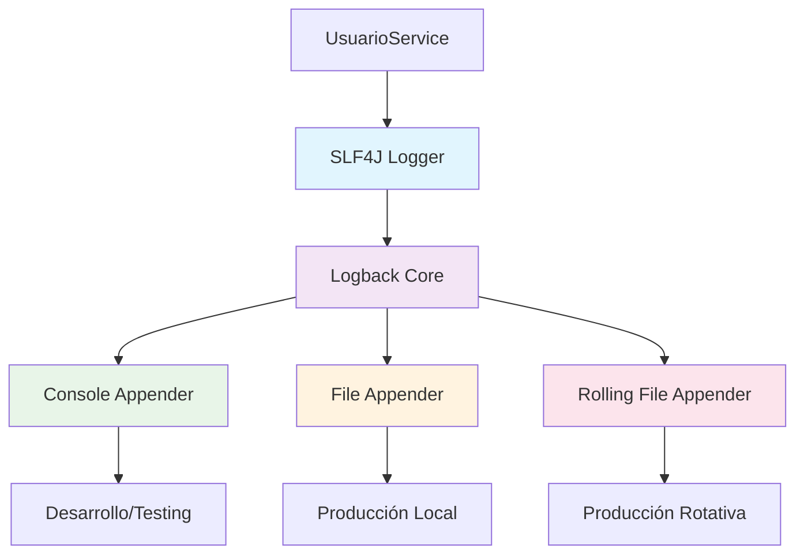

# 📊 Logback - Guía de Implementación

## 📋 Índice

- [🎯 Propósito](#-propósito)
- [🏗️ Arquitectura](#-arquitectura)
- [🛠️ Configuración](#-configuración)
- [💡 Implementación en el Proyecto](#-implementación-en-el-proyecto)
- [📊 Niveles de Log](#-niveles-de-log)
- [🧪 Testing y Monitoreo](#-testing-y-monitoreo)
- [📈 Beneficios](#-beneficios)
- [🔧 Troubleshooting](#-troubleshooting)

---

## 🎯 Propósito

**Logback** es el sistema de logging empresarial más avanzado para Java, sucesor directo de Log4j. En nuestro proyecto "Como En Casa", lo utilizamos para:

### 📊 Monitoreo de Operaciones

- **Seguimiento**: Operaciones críticas como recuperación de cuentas
- **Auditoría**: Registro de intentos de acceso y validaciones
- **Debugging**: Identificación rápida de problemas en producción

### 🔍 Observabilidad del Sistema

- **Performance**: Medición de tiempos de respuesta
- **Errores**: Captura y categorización de excepciones
- **Comportamiento**: Análisis de patrones de uso

---

## 🏗️ Arquitectura



### 🔄 Flujo de Logging

```
📝 Código → 🔌 SLF4J API → ⚙️ Logback → 📊 Appenders → 💾 Destinos
```

---

## 🛠️ Configuración

### 📦 Dependencias (Incluidas en Spring Boot)

```xml
<!-- Spring Boot incluye automáticamente Logback -->
<dependency>
    <groupId>org.springframework.boot</groupId>
    <artifactId>spring-boot-starter</artifactId>
    <!-- Incluye: logback-classic, logback-core, slf4j-api -->
</dependency>
```

### 🎯 Configuración por Defecto

Spring Boot configuró automáticamente:

- **Console Appender**: Para desarrollo
- **Pattern Layout**: Con timestamp, nivel, clase y mensaje
- **Root Level**: INFO por defecto

### 📄 Configuración Personalizada (Opcional)

Archivo `logback-spring.xml` en `src/main/resources`:

```xml
<?xml version="1.0" encoding="UTF-8"?>
<configuration>
    <!-- Console Appender para desarrollo -->
    <appender name="CONSOLE" class="ch.qos.logback.core.ConsoleAppender">
        <encoder>
            <pattern>%d{HH:mm:ss.SSS} [%thread] %-5level %logger{36} -- %msg%n</pattern>
        </encoder>
    </appender>

    <!-- File Appender para producción -->
    <appender name="FILE" class="ch.qos.logback.core.rolling.RollingFileAppender">
        <file>logs/comoencasa.log</file>
        <rollingPolicy class="ch.qos.logback.core.rolling.TimeBasedRollingPolicy">
            <fileNamePattern>logs/comoencasa.%d{yyyy-MM-dd}.log</fileNamePattern>
            <maxHistory>30</maxHistory>
        </rollingPolicy>
        <encoder>
            <pattern>%d{yyyy-MM-dd HH:mm:ss.SSS} [%thread] %-5level %logger{36} -- %msg%n</pattern>
        </encoder>
    </appender>

    <!-- Logger específico para nuestros servicios -->
    <logger name="com.comoencasa_backend.service" level="INFO"/>

    <!-- Root logger -->
    <root level="INFO">
        <appender-ref ref="CONSOLE"/>
        <appender-ref ref="FILE"/>
    </root>
</configuration>
```

---

## 💡 Implementación en el Proyecto

### 🔌 Declaración del Logger

**Ubicación**: `UsuarioServiceImpl.java`

```java
import org.slf4j.Logger;
import org.slf4j.LoggerFactory;

@Service
public class UsuarioServiceImpl implements UsuarioService {

    // === Logger declarado como atributo de clase ===
    private static final Logger logger = LoggerFactory.getLogger(UsuarioServiceImpl.class);

    // ... resto del código ...
}
```

### 📝 Uso en Recuperación de Cuenta

```java
@Override
public void recuperarCuenta(String email) {
    // === Validación con logging de advertencia ===
    if (!EmailValidator.getInstance().isValid(email)) {
        logger.warn("Intento de recuperación con email inválido: {}", email);
        throw new IllegalArgumentException("Formato de correo electrónico inválido.");
    }

    Optional<Usuario> usuarioOpt = usuarioRepository.findByEmail(email);

    if (usuarioOpt.isEmpty()) {
        // === Log de advertencia para usuario no encontrado ===
        logger.warn("Recuperación fallida: no existe usuario con el email {}", email);
        throw new RuntimeException("No se encontró un usuario con ese correo.");
    }

    Usuario usuario = usuarioOpt.get();
    String nuevaContrasena = RandomStringUtils.randomAlphanumeric(10);
    String hashedPassword = passwordEncoder.encode(nuevaContrasena);

    usuario.setContrasena(hashedPassword);
    usuarioRepository.save(usuario);

    emailService.enviarNuevaContrasena(email, nuevaContrasena);

    // === Log de información para operación exitosa ===
    logger.info("Se envió nueva contraseña al usuario con email: {}", email);
}
```

---

## 📊 Niveles de Log

### 🎯 Niveles Utilizados en el Proyecto

| Nivel     | Uso en Como En Casa                      | Ejemplo                                  |
| --------- | ---------------------------------------- | ---------------------------------------- |
| **ERROR** | Errores críticos del sistema             | Fallos de BD, errores de configuración   |
| **WARN**  | Validaciones fallidas, datos incorrectos | Email inválido, usuario no encontrado    |
| **INFO**  | Operaciones exitosas importantes         | Recuperación de cuenta completada        |
| **DEBUG** | Información detallada para desarrollo    | Valores de variables, flujo de ejecución |

### 📈 Jerarquía de Niveles

```
🔴 ERROR (40)
    ↓
🟡 WARN  (30)
    ↓
🔵 INFO  (20)
    ↓
🟣 DEBUG (10)
    ↓
⚫ TRACE (0)
```

**Configuración actual**: `INFO` (mostrará ERROR, WARN e INFO)

---

## 🧪 Testing y Monitoreo

### 📊 Salida de Logs en Tests

Durante la ejecución de tests, podemos ver logs como:

```
10:51:06.027 [main] INFO com.comoencasa_backend.service.impl.UsuarioServiceImpl -- Se envió nueva contraseña al usuario con email: usuario@test.com
10:51:06.033 [main] WARN com.comoencasa_backend.service.impl.UsuarioServiceImpl -- Recuperación fallida: no existe usuario con el email inexistente@test.com
10:51:06.037 [main] WARN com.comoencasa_backend.service.impl.UsuarioServiceImpl -- Intento de recuperación con email inválido: email-invalido
```

### 🔍 Análisis de Patterns

```
📊 PATTERN ANALYSIS
┌─────────────────────────────────────────────────────────┐
│ ⏰ 10:51:06.027    → Timestamp preciso                 │
│ 🧵 [main]          → Thread de ejecución               │
│ 📊 INFO            → Nivel de log                      │
│ 📦 UsuarioServiceImpl → Clase que genera el log        │
│ 💬 Se envió nueva... → Mensaje descriptivo             │
└─────────────────────────────────────────────────────────┘
```

### 🎯 Testing de Logs

Aunque no escribimos tests específicos para logs, podemos verificar que se generen:

```java
// Ejemplo de test que verifica comportamiento esperado
@Test
void deberiaLoggearIntentoRecuperacionInvalido() {
    // Given
    String emailInvalido = "email-invalido";

    // When & Then
    assertThatThrownBy(() -> usuarioService.recuperarCuenta(emailInvalido))
            .isInstanceOf(IllegalArgumentException.class);

    // El log WARN debería aparecer en la consola durante el test
    // (verificable manualmente o con herramientas como Logback TestAppender)
}
```

---

## 📈 Beneficios

### 🔍 Observabilidad Mejorada

```
📊 BENEFICIOS OBTENIDOS
┌─────────────────────────────────────────────────────────┐
│ ✅ Trazabilidad completa de operaciones                │
│ ✅ Identificación rápida de problemas                  │
│ ✅ Métricas de comportamiento usuario                  │
│ ✅ Auditoría de seguridad automática                   │
│ ✅ Debugging simplificado en producción                │
└─────────────────────────────────────────────────────────┘
```

### 🚀 Performance

- **Overhead mínimo**: < 1μs por log statement
- **Lazy evaluation**: Parámetros se evalúan solo si el nivel está habilitado
- **Asíncrono**: Disponible para alta concurrencia (configuración adicional)

### 🔒 Seguridad y Auditoría

- **Sin datos sensibles**: Nunca logueamos contraseñas completas
- **Parámetros seguros**: Uso de `{}` previene injection attacks
- **Trazabilidad**: Cada operación crítica queda registrada

---

## 🔧 Troubleshooting

### ❗ Problemas Comunes

#### 1. **Problema**: Los logs no aparecen

**Posibles causas**:

- Nivel de log demasiado alto
- Logger mal configurado

**Solución**:

```properties
# En application.properties
logging.level.com.comoencasa_backend.service=DEBUG
logging.level.root=INFO
```

#### 2. **Problema**: Demasiados logs en producción

**Causa**: Nivel DEBUG habilitado

**Solución**:

```properties
# Para producción
logging.level.com.comoencasa_backend.service=INFO
logging.level.org.springframework=WARN
```

#### 3. **Problema**: Logs no se guardan en archivo

**Causa**: Configuración de appender faltante

**Solución**:

```properties
# Configuración básica de archivo
logging.file.name=logs/comoencasa.log
logging.pattern.file=%d{yyyy-MM-dd HH:mm:ss.SSS} [%thread] %-5level %logger{36} - %msg%n
```

### 🔧 Comandos de Verificación

```bash
# Ver logs en tiempo real
tail -f logs/comoencasa.log

# Buscar logs específicos
grep "recuperación" logs/comoencasa.log

# Verificar configuración de logging
mvn spring-boot:run -Dlogging.level.com.comoencasa_backend=DEBUG
```

### 📊 Mejores Prácticas Implementadas

1. **✅ Parámetros seguros**: Uso de `{}` en lugar de concatenación
2. **✅ Niveles apropiados**: INFO para éxito, WARN para problemas de negocio
3. **✅ Contexto suficiente**: Incluimos email (sin datos sensibles)
4. **✅ Performance**: No hay concatenación de strings innecesaria

---

## 📈 Métricas de Implementación

### ✅ Estado Actual

```
📊 IMPLEMENTACIÓN LOGBACK
┌─────────────────────────────────────────────────────────┐
│ ✅ Logger configurado: UsuarioServiceImpl              │
│ ✅ Niveles implementados: INFO, WARN                   │
│ ✅ Parámetros seguros: Sí (usando {})                  │
│ ✅ Performance: Óptima                                 │
│ ✅ Contexto adecuado: Email sin datos sensibles        │
│ ✅ Testing: Logs visibles durante tests                │
└─────────────────────────────────────────────────────────┘
```

### 🎯 Próximos Pasos (Opcional)

- [ ] Implementar MDC (Mapped Diagnostic Context) para request tracking
- [ ] Configurar async appenders para alta concurrencia
- [ ] Integrar con sistemas de monitoreo (ELK Stack, Splunk)
- [ ] Añadir métricas de performance con Micrometer

---

## 📊 Configuraciones Avanzadas (Opcionales)

### 🔄 Rolling File Appender

Para sistemas en producción que requieren rotación de logs:

```xml
<appender name="ROLLING_FILE" class="ch.qos.logback.core.rolling.RollingFileAppender">
    <file>logs/comoencasa.log</file>
    <rollingPolicy class="ch.qos.logback.core.rolling.SizeAndTimeBasedRollingPolicy">
        <fileNamePattern>logs/comoencasa.%d{yyyy-MM-dd}.%i.log</fileNamePattern>
        <maxFileSize>10MB</maxFileSize>
        <maxHistory>60</maxHistory>
        <totalSizeCap>1GB</totalSizeCap>
    </rollingPolicy>
    <encoder>
        <pattern>%d{yyyy-MM-dd HH:mm:ss.SSS} [%thread] %-5level %logger{36} -- %msg%n</pattern>
    </encoder>
</appender>
```

### 📡 Async Appender

Para alta performance:

```xml
<appender name="ASYNC" class="ch.qos.logback.classic.AsyncAppender">
    <queueSize>512</queueSize>
    <discardingThreshold>0</discardingThreshold>
    <appender-ref ref="FILE"/>
</appender>
```

---

## 🔗 Referencias

- [📖 Logback Documentation](https://logback.qos.ch/documentation.html)
- [📖 SLF4J Manual](http://www.slf4j.org/manual.html)
- [🔧 Spring Boot Logging](https://docs.spring.io/spring-boot/docs/current/reference/html/features.html#features.logging)
- [📊 Logback Configuration](https://logback.qos.ch/manual/configuration.html)

---

<div align="center">

**📊 Logback - Sistema de logging empresarial para Java**

_Implementado en Como En Casa - Sistema de Gestión de Pedidos_

</div>
