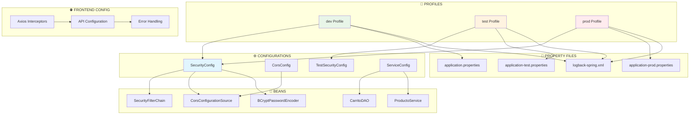

# 🔧 Patrones de Configuración y Seguridad - Como en Casa

## 📖 Introducción

Los patrones de **Configuración** y **Seguridad** son fundamentales para crear aplicaciones robustas y mantenibles. En el proyecto "Como en Casa" se implementan varios patrones para manejar la configuración de la aplicación, seguridad, CORS, y perfiles de entorno.

### **🎯 Objetivos:**

- **Configuration Pattern**: Centralizar configuraciones de la aplicación
- **Security Pattern**: Implementar autenticación y autorización
- **CORS Pattern**: Manejar peticiones cross-origin
- **Profile Pattern**: Configuraciones específicas por entorno

---

## 🎯 Implementación en el Proyecto

### 🔹 **1. Configuration Pattern**

#### **📍 Ubicación:** `config/SecurityConfig.java`

**Configuración de Seguridad con Spring Security:**

```java
@Configuration
@EnableWebSecurity
public class SecurityConfig {

    @Bean
    public SecurityFilterChain securityFilterChain(HttpSecurity http) throws Exception {
        http
                .cors(withDefaults())
                .csrf(csrf -> csrf.disable())
                .authorizeHttpRequests(auth -> auth
                        .requestMatchers("/api/auth/**").permitAll()
                        .requestMatchers("/api/productos/**").permitAll()
                        .requestMatchers("/api/carrito/**").permitAll()
                        .requestMatchers("/api/pedidos/**").permitAll()
                        .requestMatchers("/api/admin/**").permitAll()
                        .anyRequest().authenticated()
                )
                .sessionManagement(session -> session
                        .sessionCreationPolicy(SessionCreationPolicy.STATELESS)
                );

        return http.build();
    }

    @Bean
    public BCryptPasswordEncoder passwordEncoder() {
        return new BCryptPasswordEncoder();
    }

    @Bean
    public CorsConfigurationSource corsConfigurationSource() {
        CorsConfiguration configuration = new CorsConfiguration();

        // Configuración de orígenes permitidos
        configuration.setAllowedOrigins(List.of(
            "http://localhost:3000",
            "http://localhost:3001",
            "http://localhost:3002"
        ));

        configuration.setAllowedMethods(List.of("GET", "POST", "PUT", "DELETE", "OPTIONS"));
        configuration.setAllowedHeaders(List.of("*"));
        configuration.setAllowCredentials(true);

        UrlBasedCorsConfigurationSource source = new UrlBasedCorsConfigurationSource();
        source.registerCorsConfiguration("/**", configuration);

        // Logging para desarrollo
        System.out.println("✅ CORS habilitado para: " + configuration.getAllowedOrigins());

        return source;
    }
}
```

#### **📍 Ubicación:** `config/CorsConfig.java`

**Configuración CORS Dedicada:**

```java
@Configuration
public class CorsConfig {

    @Bean
    public WebMvcConfigurer corsConfigurer() {
        return new WebMvcConfigurer() {
            @Override
            public void addCorsMappings(CorsRegistry registry) {
                registry.addMapping("/**") // Aplica CORS a todas las rutas
                        .allowedOrigins("http://localhost:3000", "http://localhost:3001")
                        .allowedMethods("*") // Permite todos los métodos HTTP
                        .allowedHeaders("*") // Permite todos los encabezados
                        .allowCredentials(true); // Necesario para cookies/tokens
            }
        };
    }
}
```

---

### 🔹 **2. Profile-Based Configuration Pattern**

#### **📍 Ubicación:** `test/config/TestSecurityConfig.java`

**Configuración específica para Testing:**

```java
@TestConfiguration
@EnableWebSecurity
@Profile("test")
public class TestSecurityConfig {

    @Bean
    public SecurityFilterChain testSecurityFilterChain(HttpSecurity http) throws Exception {
        http
            .csrf(csrf -> csrf.disable())
            .authorizeHttpRequests(auth -> auth
                .anyRequest().permitAll() // Permite todo en tests
            );
        return http.build();
    }
}
```

#### **📍 Archivos de configuración por perfil:**

**application.properties (Desarrollo):**

```properties
# Configuración de base de datos
spring.datasource.url=jdbc:mysql://localhost:3306/comoencasa_db
spring.datasource.username=root
spring.datasource.password=root
spring.jpa.hibernate.ddl-auto=update

# Configuración de logging
logging.level.com.comoencasa_backend=DEBUG
logging.file.name=logs/comoencasa.log

# Configuración de email
spring.mail.host=smtp.gmail.com
spring.mail.port=587
spring.mail.username=${EMAIL_USERNAME}
spring.mail.password=${EMAIL_PASSWORD}
```

**application-test.properties (Testing):**

```properties
# Base de datos en memoria para tests
spring.datasource.url=jdbc:h2:mem:testdb
spring.datasource.driverClassName=org.h2.Driver
spring.datasource.username=sa
spring.datasource.password=

# JPA para tests
spring.jpa.database-platform=org.hibernate.dialect.H2Dialect
spring.jpa.hibernate.ddl-auto=create-drop

# Logging mínimo en tests
logging.level.org.springframework=WARN
logging.level.com.comoencasa_backend=INFO
```

**application-prod.properties (Producción):**

```properties
# Configuración de producción
spring.datasource.url=${DATABASE_URL}
spring.datasource.username=${DATABASE_USERNAME}
spring.datasource.password=${DATABASE_PASSWORD}

# JPA optimizado para producción
spring.jpa.hibernate.ddl-auto=validate
spring.jpa.show-sql=false

# Logging en producción
logging.level.com.comoencasa_backend=INFO
logging.file.name=/var/log/comoencasa/app.log
```

---

### 🔹 **3. Dependency Injection Pattern con Configuración**

#### **📍 Implementación SOLID con Configuration:**

```java
// Configuración hipotética para diferentes implementaciones
@Configuration
public class ServiceConfig {

    @Bean
    @Profile("dev")
    @Primary
    public CarritoDAO carritoDAODev() {
        return new CarritoDAOImpl(); // Implementación con cache
    }

    @Bean
    @Profile("prod")
    @Primary
    public CarritoDAO carritoDAOProd() {
        return new CarritoDAODatabaseImpl(); // Implementación con BD
    }

    @Bean
    @Profile("dev")
    @Primary
    public ProductoService productoServiceDev(ProductoRepository repository) {
        return new ProductoServiceImpl(repository); // Implementación estándar
    }

    @Bean
    @Profile("prod")
    @Primary
    public ProductoService productoServiceProd(ProductoRepository repository) {
        return new ProductoServiceCacheImpl(repository); // Con cache
    }
}
```

---

### 🔹 **4. Interceptor Pattern para API**

#### **📍 Ubicación:** `frontend/services/userServices.js`

**Interceptor para manejo de errores HTTP:**

```javascript
const api = axios.create({
  baseURL: "http://localhost:8081/api/auth",
  headers: {
    "Content-Type": "application/json",
  },
  withCredentials: false,
});

// Interceptor de respuesta para manejo centralizado de errores
api.interceptors.response.use(
  (response) => response,
  (error) => {
    if (error.response) {
      const { status, data } = error.response;
      let message = "Error en la solicitud";

      // Mapeo de códigos de estado HTTP
      switch (status) {
        case 403:
          message = data?.error || "Acceso denegado. Verifica tus permisos.";
          break;
        case 401:
          message = data?.error || "Credenciales inválidas.";
          break;
        case 400:
          message = data?.error || "Datos de solicitud incorrectos.";
          break;
        case 404:
          message = data?.error || "Recurso no encontrado.";
          break;
        case 500:
          message =
            data?.error || data?.message || "Error interno del servidor";
          break;
        default:
          message = data?.error || `Error ${status}: ${error.message}`;
      }

      // Logging centralizado
      console.error(`HTTP ${status}:`, message);

      // Creación de error personalizado
      const customError = new Error(message);
      customError.status = status;
      customError.originalError = error;

      return Promise.reject(customError);
    }

    return Promise.reject(error);
  }
);
```

---

### 🔹 **5. Logging Configuration Pattern**

#### **📍 Ubicación:** `resources/logback-spring.xml`

**Configuración de logging con Logback:**

```xml
<configuration>
    <!-- Configuración para desarrollo -->
    <springProfile name="dev">
        <appender name="STDOUT" class="ch.qos.logback.core.ConsoleAppender">
            <encoder>
                <pattern>%d{HH:mm:ss.SSS} [%thread] %-5level %logger{36} - %msg%n</pattern>
            </encoder>
        </appender>

        <logger name="com.comoencasa_backend" level="DEBUG"/>
        <root level="INFO">
            <appender-ref ref="STDOUT"/>
        </root>
    </springProfile>

    <!-- Configuración para producción -->
    <springProfile name="prod">
        <appender name="FILE" class="ch.qos.logback.core.FileAppender">
            <file>/var/log/comoencasa/app.log</file>
            <encoder>
                <pattern>%d{yyyy-MM-dd HH:mm:ss} [%thread] %-5level %logger{36} - %msg%n</pattern>
            </encoder>
        </appender>

        <logger name="com.comoencasa_backend" level="INFO"/>
        <root level="WARN">
            <appender-ref ref="FILE"/>
        </root>
    </springProfile>

    <!-- Configuración para testing -->
    <springProfile name="test">
        <appender name="STDOUT" class="ch.qos.logback.core.ConsoleAppender">
            <encoder>
                <pattern>%d{HH:mm:ss.SSS} %-5level %logger{36} - %msg%n</pattern>
            </encoder>
        </appender>

        <logger name="com.comoencasa_backend" level="WARN"/>
        <root level="ERROR">
            <appender-ref ref="STDOUT"/>
        </root>
    </springProfile>
</configuration>
```

---

## 🔄 Flujo de Configuración

### **📊 Diagrama de Configuración:**



---

## ✅ Ventajas de los Patrones de Configuración

### **🔹 Configuration Pattern:**

- **Centralización**: Toda la configuración en un lugar específico
- **Flexibilidad**: Fácil cambio de configuraciones sin recompilación
- **Separación de responsabilidades**: Configuración separada de lógica de negocio
- **Mantenibilidad**: Fácil actualización y gestión de configuraciones

### **🔹 Profile-Based Configuration:**

- **Entornos múltiples**: Configuraciones específicas para dev/test/prod
- **Flexibilidad de despliegue**: Mismo código, diferentes configuraciones
- **Testing aislado**: Configuración específica para pruebas
- **Seguridad**: Configuraciones sensibles separadas por entorno

### **🔹 Security Pattern:**

- **Autenticación centralizada**: Un punto de configuración de seguridad
- **Autorización granular**: Control de acceso por endpoints
- **CORS configurado**: Manejo seguro de peticiones cross-origin
- **Stateless**: Configuración para APIs REST

### **🔹 Interceptor Pattern:**

- **Logging centralizado**: Manejo consistente de errores
- **Error handling**: Tratamiento uniforme de errores HTTP
- **Transformación de datos**: Modificación de requests/responses
- **Monitoreo**: Seguimiento de todas las peticiones

---

## 🎯 Mejores Prácticas Implementadas

### **✅ En Configuración de Seguridad:**

- **Disable CSRF** para APIs REST stateless
- **CORS configurado** para desarrollo y producción
- **Endpoints públicos** claramente definidos
- **Encoder de passwords** con BCrypt

### **✅ En Configuración por Profiles:**

- **Base de datos H2** para tests (rápida y aislada)
- **MySQL** para desarrollo y producción
- **Logging diferenciado** por entorno
- **Configuraciones sensibles** via variables de entorno

### **✅ En Interceptors:**

- **Manejo centralizado** de errores HTTP
- **Logging detallado** para troubleshooting
- **Errores personalizados** con información útil
- **Retry logic** cuando es apropiado

### **✅ En Logging:**

- **Patterns diferenciados** por entorno
- **Niveles apropiados** (DEBUG en dev, INFO en prod)
- **Archivos de log** en producción
- **Console output** en desarrollo

---

## 🧪 Testing de Configuraciones

### **📝 Test de Configuración de Seguridad:**

```java
@SpringBootTest
@AutoConfigureTestDatabase
class SecurityConfigTest {

    @Autowired
    private MockMvc mockMvc;

    @Test
    @DisplayName("Endpoints públicos deberían ser accesibles")
    void endpointsPublicosDeberianSerAccesibles() throws Exception {
        mockMvc.perform(get("/api/productos"))
                .andExpect(status().isOk());

        mockMvc.perform(get("/api/auth/login"))
                .andExpect(status().isOk());

        mockMvc.perform(get("/api/carrito/test-session"))
                .andExpect(status().isOk());
    }

    @Test
    @DisplayName("CORS debería estar habilitado")
    void corsDeberiaEstarHabilitado() throws Exception {
        mockMvc.perform(options("/api/productos")
                .header("Origin", "http://localhost:3000")
                .header("Access-Control-Request-Method", "GET"))
                .andExpect(status().isOk())
                .andExpect(header().string("Access-Control-Allow-Origin", "http://localhost:3000"));
    }
}
```

### **📝 Test de Configuración por Profiles:**

```java
@SpringBootTest
@ActiveProfiles("test")
class ProfileConfigurationTest {

    @Autowired
    private DataSource dataSource;

    @Test
    @DisplayName("Perfil test debería usar H2 database")
    void perfilTestDeberiaUsarH2Database() throws Exception {
        String url = dataSource.getConnection().getMetaData().getURL();
        assertThat(url).contains("h2:mem");
    }
}
```

---

## 🔧 Tecnologías Utilizadas

### **⚙️ Para Configuración:**

- **Spring Boot Configuration** - Auto-configuración y beans
- **Spring Profiles** - Configuración por entornos
- **Properties Files** - Archivos de configuración externa
- **Environment Variables** - Configuración sensible

### **🔒 Para Seguridad:**

- **Spring Security** - Framework de seguridad
- **BCrypt** - Encoder de passwords
- **CORS** - Configuración cross-origin
- **JWT** (preparado para tokens)

### **🌐 Para Frontend:**

- **Axios** - Cliente HTTP
- **Interceptors** - Manejo de requests/responses
- **Error Handling** - Tratamiento de errores
- **Environment Variables** - Configuración de URLs

### **📊 Para Logging:**

- **Logback** - Framework de logging
- **SLF4J** - API de logging
- **Profile-based config** - Configuración por entorno
- **File Appenders** - Escritura a archivos

---

## 🚀 Conclusión

Los patrones de **Configuración y Seguridad** en el proyecto "Como en Casa" proporcionan:

- ✅ **Configuración centralizada** y mantenible
- ✅ **Seguridad robusta** con Spring Security
- ✅ **Flexibilidad por entornos** con Spring Profiles
- ✅ **Manejo de errores** consistente y centralizado
- ✅ **Logging configurado** apropiadamente para cada entorno
- ✅ **CORS configurado** para desarrollo seguro

Esta implementación demuestra un enfoque profesional para la configuración de aplicaciones web modernas, balanceando seguridad, flexibilidad y mantenibilidad.
