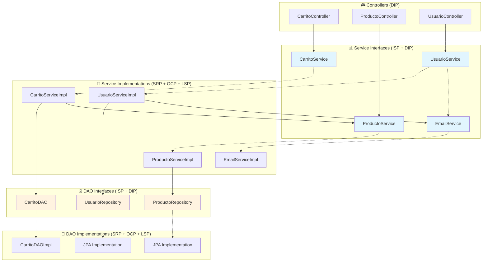

# 💎 Principios SOLID - Como en Casa

## 📖 Introducción

Los **principios SOLID** son cinco principios de diseño orientado a objetos que ayudan a crear software más mantenible, flexible y escalable. Estos principios fueron introducidos por Robert C. Martin y son fundamentales para escribir código limpio y bien estructurado.

### **🎯 Los 5 Principios:**

- **S** - Single Responsibility Principle (SRP)
- **O** - Open/Closed Principle (OCP)
- **L** - Liskov Substitution Principle (LSP)
- **I** - Interface Segregation Principle (ISP)
- **D** - Dependency Inversion Principle (DIP)

---

## 🎯 Implementación de SOLID en el Proyecto

### 🔹 **1. Single Responsibility Principle (SRP)**

> _"Una clase debe tener una sola razón para cambiar"_

#### **📍 Implementación:**

**✅ EmailServiceImpl - Responsabilidad única: Envío de emails**

```java
@Service
public class EmailServiceImpl implements EmailService {

    private final JavaMailSender mailSender;

    // ÚNICA RESPONSABILIDAD: Enviar emails
    @Override
    public void enviarNuevaContrasena(String destinoEmail, String nuevaContrasena) {
        // Validaciones específicas de email
        if (!esEmailValido(destinoEmail.trim())) {
            throw new IllegalArgumentException("Formato de email inválido");
        }

        SimpleMailMessage mensaje = new SimpleMailMessage();
        mensaje.setFrom(remitente);
        mensaje.setTo(destinoEmail.trim());
        mensaje.setSubject("Recuperación de cuenta - Como En Casa");
        mensaje.setText("Tu nueva contraseña es: " + nuevaContrasena);
        mailSender.send(mensaje);
    }

    @Override
    public void enviarTokenVerificacion(String destinoEmail, String token) {
        // Lógica específica para tokens de verificación
    }

    // Método auxiliar - relacionado con la responsabilidad principal
    public boolean esEmailValido(String email) {
        if (email == null || email.isEmpty()) return false;
        int atIndex = email.indexOf('@');
        return atIndex > 0 && atIndex < email.length() - 1;
    }
}
```

**✅ ProductoServiceImpl - Responsabilidad única: Gestión de productos**

```java
@Service
@Slf4j
public class ProductoServiceImpl implements ProductoService {

    @Autowired
    private ProductoRepository productoRepository;

    // ÚNICA RESPONSABILIDAD: Operaciones de productos
    @Override
    public List<Producto> findAllAvailable() {
        return productoRepository.findByDisponibleTrue();
    }

    @Override
    public Producto actualizarStock(Long productoId, Integer nuevaCantidad) {
        // Validaciones específicas de stock
        if (productoId == null) {
            throw new IllegalArgumentException("El ID del producto no puede ser nulo");
        }
        if (nuevaCantidad == null || nuevaCantidad < 0) {
            throw new IllegalArgumentException("La cantidad no puede ser nula o negativa");
        }

        Optional<Producto> productoOpt = productoRepository.findById(productoId);
        if (productoOpt.isPresent()) {
            Producto producto = productoOpt.get();
            producto.setCantidad(nuevaCantidad);

            // Lógica de negocio específica de productos
            if (nuevaCantidad > 0) {
                producto.setDisponible(true);
            } else {
                producto.setDisponible(false);
            }

            return productoRepository.save(producto);
        }
        throw new IllegalArgumentException("Producto no encontrado");
    }

    // Método auxiliar - relacionado con la responsabilidad principal
    private void sanitize(Producto p) {
        p.setNombre(StringEscapeUtils.escapeHtml4(StringUtils.trimToEmpty(p.getNombre())));
        p.setDescripcion(StringEscapeUtils.escapeHtml4(StringUtils.trimToEmpty(p.getDescripcion())));
    }
}
```

### 🔹 **2. Open/Closed Principle (OCP)**

> _"Las clases deben estar abiertas para extensión, pero cerradas para modificación"_

#### **📍 Implementación:**

**✅ Sistema de Services extensible sin modificar código existente**

```java
// Interface base - CERRADA para modificación
public interface EmailService {
    void enviarNuevaContrasena(String destinoEmail, String nuevaContrasena);
    void enviarEmailRecuperacion(String destinoEmail, String token);
    void enviarTokenVerificacion(String destinoEmail, String token);
}

// Implementación actual - CERRADA para modificación
@Service
public class EmailServiceImpl implements EmailService {
    // Implementación estable
}

// EXTENSIÓN: Nueva implementación sin modificar la existente
@Service
@Profile("sms")
public class SMSEmailServiceImpl implements EmailService {

    @Override
    public void enviarNuevaContrasena(String destinoEmail, String nuevaContrasena) {
        // Nueva funcionalidad: envío por SMS además de email
        enviarEmail(destinoEmail, nuevaContrasena);
        enviarSMS(destinoEmail, nuevaContrasena);
    }

    // Nuevos métodos sin afectar la interface existente
    private void enviarSMS(String telefono, String mensaje) {
        // Lógica de SMS
    }
}
```

**✅ Sistema de DAO extensible**

```java
// Interface DAO - CERRADA para modificación
public interface CarritoDAO {
    void guardarCarrito(String sessionId, CarritoDTO carrito);
    Optional<CarritoDTO> obtenerCarrito(String sessionId);
    void eliminarCarrito(String sessionId);
}

// Implementación actual con Cache - CERRADA para modificación
@Repository
public class CarritoDAOImpl implements CarritoDAO {
    private final Cache<String, CarritoDTO> carritoCache;
    // Implementación con Guava Cache
}

// EXTENSIÓN: Nueva implementación sin modificar la existente
@Repository
@Profile("database")
public class CarritoDAODatabaseImpl implements CarritoDAO {

    private final CarritoRepository carritoRepository;

    @Override
    public void guardarCarrito(String sessionId, CarritoDTO carrito) {
        // Nueva funcionalidad: persistencia en base de datos
        CarritoEntity entity = toEntity(carrito);
        carritoRepository.save(entity);
    }
}
```

### 🔹 **3. Liskov Substitution Principle (LSP)**

> _"Los objetos de una superclase deben ser reemplazables por objetos de sus subclases sin alterar el funcionamiento"_

#### **📍 Implementación:**

**✅ Substitución de implementaciones de Service**

```java
// Contrato base que todas las implementaciones deben cumplir
public interface ProductoService {
    List<Producto> findAllAvailable();
    Optional<Producto> findById(Long id);
    Producto actualizarStock(Long productoId, Integer nuevaCantidad);
}

// Implementación principal
@Service
@Primary
public class ProductoServiceImpl implements ProductoService {

    @Override
    public List<Producto> findAllAvailable() {
        // Retorna productos disponibles desde BD
        return productoRepository.findByDisponibleTrue();
    }

    @Override
    public Optional<Producto> findById(Long id) {
        if (id == null) {
            throw new IllegalArgumentException("El ID no puede ser nulo");
        }
        return productoRepository.findById(id);
    }
}

// Implementación alternativa - SUSTITUIBLE sin romper funcionalidad
@Service
@Profile("cache")
public class ProductoServiceCacheImpl implements ProductoService {

    private final ProductoRepository productoRepository;
    private final Cache<Long, Producto> productCache;

    @Override
    public List<Producto> findAllAvailable() {
        // Misma funcionalidad, diferente implementación
        return getCachedProducts().stream()
                .filter(Producto::getDisponible)
                .collect(Collectors.toList());
    }

    @Override
    public Optional<Producto> findById(Long id) {
        // Mantiene el mismo contrato: validación + retorno
        if (id == null) {
            throw new IllegalArgumentException("El ID no puede ser nulo");
        }
        return Optional.ofNullable(productCache.getIfPresent(id));
    }
}
```

**✅ Uso polimórfico en CarritoService**

```java
@Service
public class CarritoServiceImpl implements CarritoService {

    // Cualquier implementación de ProductoService es válida
    private final ProductoService productoService;

    public CarritoServiceImpl(ProductoService productoService) {
        this.productoService = productoService; // LSP: cualquier implementación funciona
    }

    @Override
    public CarritoDTO agregarProducto(String sessionId, Long productoId, Integer cantidad, String comentarios) {
        // El código funciona igual con ProductoServiceImpl o ProductoServiceCacheImpl
        Optional<Producto> productoOpt = productoService.findById(productoId);
        if (!productoOpt.isPresent()) {
            throw new IllegalArgumentException("Producto no encontrado");
        }
        // ... resto de lógica
    }
}
```

### 🔹 **4. Interface Segregation Principle (ISP)**

> _"Los clientes no deben ser forzados a depender de interfaces que no usan"_

#### **📍 Implementación:**

**✅ Interfaces específicas en lugar de una interface monolítica**

```java
// ❌ MAL: Interface monolítica (violación de ISP)
// public interface UsuarioServiceMonolitico {
//     Optional<Usuario> buscarPorEmail(String email);
//     void actualizarContrasena(Usuario usuario, String nuevaContrasena);
//     void recuperarCuenta(String email);
//     String generarTokenVerificacion(String email);
//     boolean activarCuenta(String token);
//     List<Usuario> obtenerTodosLosUsuarios(); // ¿Por qué EmailService necesitaría esto?
//     void eliminarUsuario(Long id); // ¿Por qué AuthService necesitaría esto?
// }

// ✅ BIEN: Interfaces segregadas por responsabilidad
public interface UsuarioService {
    // Solo operaciones esenciales de usuario
    Optional<Usuario> buscarPorEmail(String email);
    void actualizarContrasena(Usuario usuario, String nuevaContrasena);
    void recuperarCuenta(String email);
}

public interface VerificationTokenService {
    // Solo operaciones de tokens
    String generarToken(String email);
    String obtenerEmailPorToken(String token);
    void eliminarToken(String token);
    boolean tokenEsValido(String token);
}

// Interface específica para cada tipo de email
public interface EmailService {
    // Solo operaciones de envío de email
    void enviarNuevaContrasena(String destinoEmail, String nuevaContrasena);
    void enviarEmailRecuperacion(String destinoEmail, String token);
    void enviarTokenVerificacion(String destinoEmail, String token);
}
```

**✅ Repositories específicos**

```java
// Interface específica para productos
public interface ProductoRepository extends JpaRepository<Producto, Long> {
    List<Producto> findByDisponibleTrue();
    List<Producto> findByCategoriaIdAndDisponibleTrue(Long categoriaId);
}

// Interface específica para usuarios
public interface UsuarioRepository extends JpaRepository<Usuario, Long> {
    Optional<Usuario> findByEmail(String email);
    boolean existsByEmail(String email);
}

// Interface específica para pedidos
public interface PedidoRepository extends JpaRepository<Pedido, Long> {
    List<Pedido> findByUsuarioId(Long usuarioId);
}

// Interface específica para comprobantes
public interface ComprobanteRepository extends JpaRepository<Comprobante, Long> {
    long countByTipo(TipoComprobante tipo);
    List<Comprobante> findByPedido_Id(Long pedidoId);
    List<Comprobante> findByFechaEmisionBetween(LocalDateTime desde, LocalDateTime hasta);
}
```

### 🔹 **5. Dependency Inversion Principle (DIP)**

> _"Depender de abstracciones, no de concreciones"_

#### **📍 Implementación:**

**✅ Inyección de dependencias con interfaces**

```java
@Service
public class CarritoServiceImpl implements CarritoService {

    // DIP: Depende de abstracciones (interfaces), no de implementaciones concretas
    private final CarritoDAO carritoDAO;           // Interface, no CarritoDAOImpl
    private final ProductoService productoService; // Interface, no ProductoServiceImpl

    // Constructor injection con abstracciones
    public CarritoServiceImpl(CarritoDAO carritoDAO, ProductoService productoService) {
        this.carritoDAO = carritoDAO;
        this.productoService = productoService;
        log.info("CarritoService inicializado con DAO y ProductoService");
    }

    @Override
    public CarritoDTO agregarProducto(String sessionId, Long productoId, Integer cantidad, String comentarios) {
        // Usa abstracciones - no sabe qué implementación específica está usando
        Optional<Producto> productoOpt = productoService.findById(productoId);
        Optional<CarritoDTO> carritoOpt = carritoDAO.obtenerCarrito(sessionId);

        // ... lógica de negocio ...

        carritoDAO.guardarCarrito(sessionId, carrito);
        return carrito;
    }
}
```

**✅ Configuración de Spring permite cambio de implementaciones**

```java
// Configuración para desarrollo (cache en memoria)
@Configuration
@Profile("dev")
public class DevConfig {

    @Bean
    @Primary
    public CarritoDAO carritoDAO() {
        return new CarritoDAOImpl(); // Implementación con cache
    }

    @Bean
    @Primary
    public ProductoService productoService(ProductoRepository repository) {
        return new ProductoServiceImpl(repository); // Implementación estándar
    }
}

// Configuración para producción (base de datos)
@Configuration
@Profile("prod")
public class ProdConfig {

    @Bean
    @Primary
    public CarritoDAO carritoDAO() {
        return new CarritoDAODatabaseImpl(); // Implementación con BD
    }

    @Bean
    @Primary
    public ProductoService productoService(ProductoRepository repository) {
        return new ProductoServiceCacheImpl(repository); // Implementación con cache
    }
}
```

**✅ UsuarioService con múltiples dependencias abstraídas**

```java
@Service
public class UsuarioServiceImpl implements UsuarioService {

    // DIP: Todas las dependencias son abstracciones
    private final UsuarioRepository usuarioRepository;           // Interface JPA
    private final BCryptPasswordEncoder passwordEncoder;         // Interface Spring Security
    private final EmailService emailService;                     // Interface custom
    private final VerificationTokenService verificationTokenService; // Interface custom

    @Autowired
    public UsuarioServiceImpl(
            UsuarioRepository usuarioRepository,
            BCryptPasswordEncoder passwordEncoder,
            EmailService emailService,
            VerificationTokenService verificationTokenService
    ) {
        // Inyección de abstracciones - fácil testing y cambio de implementaciones
        this.usuarioRepository = usuarioRepository;
        this.passwordEncoder = passwordEncoder;
        this.emailService = emailService;
        this.verificationTokenService = verificationTokenService;
    }

    @Override
    public void recuperarCuenta(String email) {
        // Usa abstracciones - no implementaciones concretas
        Optional<Usuario> usuarioOpt = usuarioRepository.findByEmail(email);

        if (usuarioOpt.isPresent()) {
            Usuario usuario = usuarioOpt.get();
            String nuevaPassword = generarPasswordAleatoria();
            usuario.setPassword(passwordEncoder.encode(nuevaPassword));
            usuarioRepository.save(usuario);
            emailService.enviarNuevaContrasena(email, nuevaPassword);
        }
    }
}
```

---

## 🔄 Diagrama de Dependencias SOLID



---

## ✅ Beneficios de SOLID en el Proyecto

### **🔹 Single Responsibility (SRP):**

- **Mantenimiento fácil**: Cada clase tiene una razón específica para cambiar
- **Testing simplificado**: Tests enfocados en una responsabilidad
- **Debugging mejorado**: Errores localizados en clases específicas

### **🔹 Open/Closed (OCP):**

- **Extensibilidad**: Nuevas funcionalidades sin modificar código existente
- **Estabilidad**: Código base protegido de cambios que introducen bugs
- **Flexibilidad**: Múltiples implementaciones para diferentes entornos

### **🔹 Liskov Substitution (LSP):**

- **Polimorfismo real**: Implementaciones intercambiables sin romper funcionalidad
- **Testing robusto**: Mismas pruebas funcionan con diferentes implementaciones
- **Configuración flexible**: Cambio de implementaciones vía configuración

### **🔹 Interface Segregation (ISP):**

- **Acoplamiento bajo**: Clientes dependen solo de métodos que necesitan
- **Interfaces cohesivas**: Métodos relacionados agrupados lógicamente
- **Evolución independiente**: Interfaces pueden evolucionar sin afectar otros clientes

### **🔹 Dependency Inversion (DIP):**

- **Desacoplamiento**: Módulos de alto nivel independientes de detalles de implementación
- **Testing efectivo**: Fácil mocking de dependencias
- **Inversión de control**: Spring maneja la creación e inyección de dependencias

---

## 🧪 Testing con SOLID

### **📝 Tests facilitados por SRP:**

```java
@ExtendWith(MockitoExtension.class)
class EmailServiceTDDTest {

    @Mock
    private JavaMailSender mockMailSender;

    @InjectMocks
    private EmailServiceImpl emailService;

    @Test
    @DisplayName("Debería enviar email de nueva contraseña correctamente")
    void deberiaEnviarEmailNuevaContrasena() {
        // Test enfocado en UNA responsabilidad: envío de emails
        String email = "test@test.com";
        String password = "newPass123";

        emailService.enviarNuevaContrasena(email, password);

        verify(mockMailSender).send(any(SimpleMailMessage.class));
    }
}
```

### **📝 Tests facilitados por DIP:**

```java
@ExtendWith(MockitoExtension.class)
class CarritoServiceTDDTest {

    // Fácil mocking de dependencias abstraídas
    @Mock
    private CarritoDAO carritoDAO;

    @Mock
    private ProductoService productoService;

    @InjectMocks
    private CarritoServiceImpl carritoService;

    @Test
    @DisplayName("Debería agregar producto correctamente")
    void deberiaAgregarProducto() {
        // Given
        when(productoService.findById(1L)).thenReturn(Optional.of(producto));
        when(carritoDAO.obtenerCarrito(sessionId)).thenReturn(Optional.empty());

        // When
        CarritoDTO resultado = carritoService.agregarProducto(sessionId, 1L, 2, "");

        // Then
        verify(carritoDAO).guardarCarrito(eq(sessionId), any(CarritoDTO.class));
    }
}
```

---

## 🚀 Conclusión

Los **principios SOLID** en el proyecto "Como en Casa" proporcionan una base sólida que:

- ✅ **Mejora la mantenibilidad** con responsabilidades claras (SRP)
- ✅ **Facilita la extensión** sin modificar código existente (OCP)
- ✅ **Permite substitución** segura de implementaciones (LSP)
- ✅ **Reduce acoplamiento** con interfaces específicas (ISP)
- ✅ **Invierte dependencias** para mayor flexibilidad (DIP)

Esta implementación demuestra un entendimiento profundo de los principios SOLID y su aplicación práctica en un proyecto real, resultando en un código más limpio, testeable y mantenible.
